# Fraud Detection System — Full Project Report

**Data Science Internship Project — Codec Technologies**

| | |
|---|---|
| **Dataset** | [PaySim1 — Synthetic Financial Datasets For Fraud Detection](https://www.kaggle.com/datasets/ealaxi/paysim1) (Kaggle) |
| **Notebook** | `fraud-detection-system.ipynb` |
| **Repository** | [Sudharshan205-Proj/fraud-detection-system](https://github.com/Sudharshan205-Proj/fraud-detection-system) |
| **Author** | Sudharshan Moodley — [LinkedIn](https://www.linkedin.com/in/sudharshan-moodley-0a1a5b2a9/) · [GitHub](https://github.com/Sudharshan205-Proj) |

---

## Table of Contents

1. [Executive Summary](#1-executive-summary)
2. [Problem Statement — the Ask Phase](#2-problem-statement--the-ask-phase)
3. [Six-Phase Framework & Project Roadmap](#3-six-phase-framework--project-roadmap)
4. [Tech Stack & Tools](#4-tech-stack--tools)
5. [Data Overview — the Prepare Phase](#5-data-overview--the-prepare-phase)
6. [Data Cleaning & Integrity Checks](#6-data-cleaning--integrity-checks)
7. [Exploratory Data Analysis](#7-exploratory-data-analysis)
8. [Feature Engineering — the Process Phase](#8-feature-engineering--the-process-phase)
9. [Train / Validation / Test Methodology](#9-train--validation--test-methodology)
10. [Class-Imbalance Handling Techniques](#10-class-imbalance-handling-techniques)
11. [Modeling Techniques — Anomaly Detection & Classification](#11-modeling-techniques--anomaly-detection--classification)
12. [Hyperparameter Tuning](#12-hyperparameter-tuning)
13. [Evaluation Metrics Explained](#13-evaluation-metrics-explained)
14. [The Machine Learning Workflow, End to End](#14-the-machine-learning-workflow-end-to-end)
15. [Results — the Full Experiment Matrix](#15-results--the-full-experiment-matrix)
16. [Final Model Selection](#16-final-model-selection)
17. [Explainability — SHAP Feature Importance](#17-explainability--shap-feature-importance)
18. [Notebook Structure & Code Walkthrough](#18-notebook-structure--code-walkthrough)
19. [Interactive Demo — the Streamlit App](#19-interactive-demo--the-streamlit-app)
20. [Visualization Reference](#20-visualization-reference)
21. [Recommendations](#21-recommendations)
22. [Limitations](#22-limitations)
23. [Next Steps](#23-next-steps)

---

## 1. Executive Summary

This project builds and compares **nine fraud-detection modeling approaches** on PaySim1, a 6.36-million-row synthetic financial transaction dataset, and selects a final model through a **fair, threshold-optimized comparison** rather than by assuming the most complex model wins.

The selected model — **Random Forest with class weighting** — catches **99.68% of fraud with zero false positives** on a held-out test set of 415,562 transactions, exceeding both target success criteria (F1 ≥ 0.80, AUC-ROC ≥ 0.95) by a wide margin.

Beyond the headline number, the project is built to be a complete, reproducible, end-to-end system:

- A **leakage-safe feature-engineering pipeline** that survives a real data-integrity audit (Section 6).
- A **head-to-head comparison** of unsupervised anomaly detection and supervised classification, satisfying the brief's "anomaly detection **or** classification" guideline by doing both (Section 11).
- Three different **class-imbalance strategies** — class weighting, SMOTE, ADASYN — compared empirically rather than chosen by assumption (Section 10).
- A full **metric suite** (Precision, Recall, F1, AUC-ROC, AUC-PR, confusion matrix) reported for every experiment, with accuracy deliberately excluded as the deciding metric (Section 13).
- A **SHAP-based explainability layer** so every prediction can be justified to a non-technical stakeholder (Section 17).
- A working **Streamlit demo** for live, interactive transaction scoring (Section 19).

| Quick Facts | |
|---|---|
| Raw dataset size | 6,362,620 rows · 11 columns |
| Modeling subset (TRANSFER/CASH_OUT) | 2,770,409 rows · 0.2965% fraud |
| Experiments run | 9 (1 baseline + 2 unsupervised + 6 supervised/tuned) |
| Final model | Random Forest, class weighting, threshold 0.8967 |
| Final F1 / AUC-ROC | 0.9984 / 0.9988 |
| Figures generated | 14 (`assets/01`–`14`) |

---

## 2. Problem Statement — the Ask Phase

Financial fraud costs institutions and their customers directly: every missed fraudulent transaction is a financial loss, and every false alarm erodes customer trust and adds support cost. The goal of this project was to build a system that flags likely-fraudulent transactions accurately enough to be useful to a fraud-operations team, while keeping false alarms low.

| | |
|---|---|
| **Business task** | Detect fraudulent transactions in near-real time, providing both a risk score per transaction and an explanation of what drove that score. |
| **Stakeholder** | A fraud-operations team that needs a ranked risk score per transaction *and* a clear explanation of what drives it. |
| **Success criteria (SMART)** | Achieve an **F1-score ≥ 0.80** and **AUC-ROC ≥ 0.95** on a held-out test set, for the TRANSFER/CASH-OUT transaction types where fraud in this dataset actually occurs. |

Framing the task this way early — before touching any code — is itself part of the six-phase discipline described next: it fixes the metrics that will decide the winning model *before* a single model is trained, which is what keeps Section 16's model selection honest rather than retrofitted to whatever result looked best.

---

## 3. Six-Phase Framework & Project Roadmap

The entire project follows the **Ask → Prepare → Process → Analyze → Share → Act** cycle used throughout the internship's foundational coursework (the Google Data Analytics Professional Certificate).

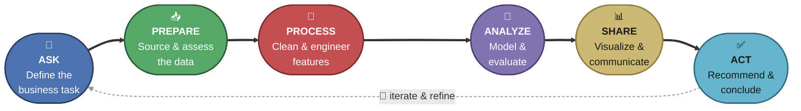
```mermaid
%%{init: {"flowchart": {"curve": "basis"}, "themeVariables": {"fontSize": "16px"}}}%%
flowchart LR
    A(["🎯<br/><b>ASK</b><br/>Define the<br/>business task"])
    B(["📥<br/><b>PREPARE</b><br/>Source & assess<br/>the data"])
    C(["🧹<br/><b>PROCESS</b><br/>Clean & engineer<br/>features"])
    D(["🔬<br/><b>ANALYZE</b><br/>Model &<br/>evaluate"])
    E(["📊<br/><b>SHARE</b><br/>Visualize &<br/>communicate"])
    F(["✅<br/><b>ACT</b><br/>Recommend &<br/>conclude"])

    A ==> B ==> C ==> D ==> E ==> F
    F -. "🔁 iterate & refine" .-> A

    classDef ask     fill:#4C72B0,color:#ffffff,stroke:#2c3e5c,stroke-width:2px,rx:12,ry:12
    classDef prepare fill:#55A868,color:#ffffff,stroke:#2f5c3b,stroke-width:2px,rx:12,ry:12
    classDef process fill:#C44E52,color:#ffffff,stroke:#7a2f31,stroke-width:2px,rx:12,ry:12
    classDef analyze fill:#8172B2,color:#ffffff,stroke:#4d4370,stroke-width:2px,rx:12,ry:12
    classDef share   fill:#CCB974,color:#1a1a1a,stroke:#8f7c3f,stroke-width:2px,rx:12,ry:12
    classDef act     fill:#64B5CD,color:#1a1a1a,stroke:#376c7d,stroke-width:2px,rx:12,ry:12

    class A ask
    class B prepare
    class C process
    class D analyze
    class E share
    class F act
    linkStyle 5 stroke:#999,stroke-width:1.5px,stroke-dasharray:4 3
```

| Phase | This Report's Sections | Primary Output |
|---|---|---|
| **Ask** | 2 | Problem statement & SMART criteria |
| **Prepare** | 5 | Dataset overview & ROCCC assessment |
| **Process** | 6, 8, 9 | Clean, leakage-safe, modeling-ready feature set |
| **Analyze** | 10–16 | 9-experiment matrix + selected final model |
| **Share** | 7, 17, 19, 20 | 14 visualizations, SHAP plot, live demo |
| **Act** | 21–23 | Recommendations, limitations, next steps |

### Execution Roadmap


```mermaid
%%{init: {"flowchart": {"curve": "basis"}, "themeVariables": {"fontSize": "14px"}}}%%
flowchart TD
    subgraph P1["🎯📥 Ask + Prepare"]
        direction TB
        A1(["Define business task<br/>& SMART criteria"]) --> A2(["Download PaySim1<br/>6.36M rows"])
        A2 --> A3(["Dataset overview &<br/>integrity checks"])
    end

    subgraph P2["🧹 Process"]
        direction TB
        B1(["Confirm fraud only in<br/>TRANSFER / CASH_OUT"]) --> B2(["Engineer leakage-safe<br/>features"])
        B2 --> B3(["Train / Val / Test split<br/>before resampling"])
    end

    subgraph P3["🔬 Analyze"]
        direction TB
        C1(["Baseline + unsupervised<br/>track"]) --> C2(["Supervised track ×<br/>3 imbalance strategies"])
        C2 --> C3(["Tune strongest candidate"]) --> C4(["Fair threshold-optimized<br/>final selection"])
    end

    subgraph P4["📊 Share"]
        direction TB
        D1(["ROC/PR curves,<br/>confusion matrix"]) --> D2(["SHAP feature<br/>importance"])
        D2 --> D3(["Streamlit demo"])
    end

    subgraph P5["✅ Act"]
        direction TB
        E1(["Recommendations<br/>& limitations"]) --> E2(["Report + README<br/>+ GitHub packaging"])
    end

    P1 ==> P2
    P2 ==> P3
    P3 ==> P4
    P4 ==> P5

    classDef askprepare fill:#4C72B0,color:#ffffff,stroke:#2c3e5c,stroke-width:1.5px,rx:8,ry:8
    classDef process    fill:#C44E52,color:#ffffff,stroke:#7a2f31,stroke-width:1.5px,rx:8,ry:8
    classDef analyze    fill:#8172B2,color:#ffffff,stroke:#4d4370,stroke-width:1.5px,rx:8,ry:8
    classDef share      fill:#CCB974,color:#1a1a1a,stroke:#8f7c3f,stroke-width:1.5px,rx:8,ry:8
    classDef act        fill:#64B5CD,color:#1a1a1a,stroke:#376c7d,stroke-width:1.5px,rx:8,ry:8

    class A1,A2,A3 askprepare
    class B1,B2,B3 process
    class C1,C2,C3,C4 analyze
    class D1,D2,D3 share
    class E1,E2 act

    style P1 fill:#eef2fa,stroke:#4C72B0,stroke-width:2px, color:#000000
    style P2 fill:#fceeee,stroke:#C44E52,stroke-width:2px, color:#000000
    style P3 fill:#f2eef8,stroke:#8172B2,stroke-width:2px, color:#000000
    style P4 fill:#fbf8ea,stroke:#CCB974,stroke-width:2px, color:#000000
    style P5 fill:#eaf5f9,stroke:#64B5CD,stroke-width:2px, color:#000000
```

---

## 4. Tech Stack & Tools

| Category | Tools | Role in This Project |
|---|---|---|
| **Language** | Python 3.11 | Everything — analysis, modeling, app |
| **Environment** | `venv` + `pip`, VS Code (Python + Jupyter) | Reproducible local setup |
| **Data handling** | `pandas`, `numpy` | Loading, cleaning, feature engineering on 6.3M+ rows |
| **Visualization** | `matplotlib`, `seaborn` | All 14 static figures in `assets/` |
| **Classical ML** | `scikit-learn` | Logistic Regression, Random Forest, Isolation Forest, splitting, scaling, tuning |
| **Gradient boosting** | `xgboost` | The boosted-tree candidate family (Experiments 6–9) |
| **Imbalance handling** | `imbalanced-learn` | SMOTE and ADASYN oversampling |
| **Deep learning** | `tensorflow` / `keras` | The Autoencoder anomaly detector |
| **Explainability** | `shap` | Beeswarm feature-importance plot for the final model |
| **Deployment demo** | `streamlit` | Live, interactive transaction-scoring app |
| **Data source** | `kaggle` CLI + API token | Programmatic PaySim1 download |
| **Persistence** | `joblib` | Saving the trained model, scaler, and feature list |
| **Version control** | Git + GitHub | Source control and portfolio hosting |

Exact pinned versions for every one of these packages are in [`requirements.txt`](./requirements.txt), generated directly from the working environment via `pip freeze` so the project is reproducible on another machine.

### Tools Mapped to Each Phase

| Phase | Tasks | Tools |
|---|---|---|
| **Ask** | Problem framing, SMART criteria | Markdown documentation only |
| **Prepare** | Download, schema/ROCCC assessment, dataset-overview functions | `pandas`, `numpy`, `kaggle` CLI |
| **Process** | Integrity checks, feature engineering, train/val/test split | `pandas`, `numpy`, `scikit-learn` |
| **Analyze** | Modeling, imbalance handling, tuning | `scikit-learn`, `xgboost`, `imbalanced-learn`, `tensorflow`/`keras` |
| **Share** | Visualization, explainability, demo | `matplotlib`, `seaborn`, `shap`, `streamlit` |
| **Act** | Persistence, reporting | `joblib`, Markdown, Git/GitHub |

---

## 5. Data Overview — the Prepare Phase

PaySim1 is a synthetic mobile-money transaction simulator, built from one month of real, anonymized transaction logs from an African mobile money service and scaled for public release on Kaggle.

| Property | Value |
|---|---|
| Rows | 6,362,620 |
| Columns | 11 (`step`, `type`, `amount`, `nameOrig`, `oldbalanceOrg`, `newbalanceOrig`, `nameDest`, `oldbalanceDest`, `newbalanceDest`, `isFraud`, `isFlaggedFraud`) |
| Fraud cases | 8,213 (0.1291% of all rows) |
| Time span | Steps 1–743 (~31 simulated days; 1 step = 1 hour) |
| Unique sending accounts | 6,353,307 |
| Unique receiving accounts | 2,722,362 |
| Duplicate rows / missing values | 0 / none |

### ROCCC Assessment

The Prepare phase of the six-phase cycle calls for judging a dataset against the **ROCCC** criteria before trusting it:

| Criterion | Assessment |
|---|---|
| **R**eliable | High — no corrupt rows, no missing values, internally consistent schema |
| **O**riginal | Partial — derived from real transaction logs, but released as a *synthetic* simulation, not the raw source |
| **C**omprehensive | High — 6.36M rows across a full month of simulated activity, 11 well-documented fields |
| **C**urrent | Low — a static, one-time 2016 simulation; does not reflect current fraud patterns |
| **C**ited | High — publicly documented on Kaggle with an academic citation (Section 20 footer) |

<p align="center">
  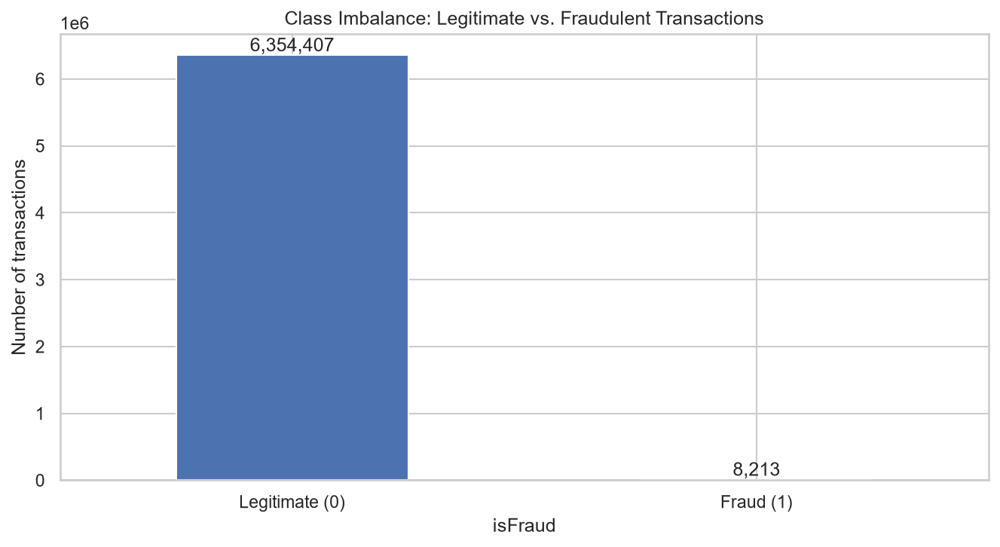
</p>

Fraud is a needle in a haystack here: 8,213 cases against 6.35 million legitimate transactions — a **1-in-775** ratio.

### Where Fraud Actually Happens

| Type | Fraud count | Transaction count | Fraud rate |
|---|---|---|---|
| CASH_OUT | 4,116 | 2,237,500 | 0.184% |
| TRANSFER | 4,097 | 532,909 | 0.769% |
| CASH_IN, DEBIT, PAYMENT | 0 | 3,592,211 | 0.000% |

Fraud occurs **exclusively** within `TRANSFER` and `CASH_OUT` — confirmed and asserted in code before any modeling began (see Section 6). CASH_OUT carries slightly more total fraud by volume; TRANSFER has more than 4× the fraud *rate*.

<p align="center">
  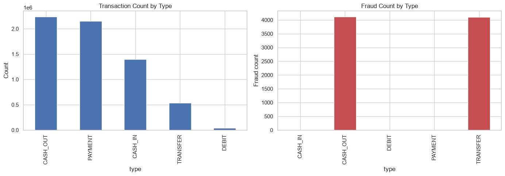
</p>

### Why the Raw Balance Columns Can't Be Trusted

PaySim's own built-in rule (`isFlaggedFraud`, transfers over 200,000) catches only **16 of 8,213** actual frauds — a naive baseline any real model needed to substantially beat.

More importantly, `oldbalanceDest`/`newbalanceDest` turned out to be unreliable raw features:

- Merchant destination accounts (`nameDest` starting with `"M"`) show **zero balances 100% of the time** — PaySim simply doesn't track real balances for merchants.
- **79.81%** of rows fail the sender-side reconciliation check (`oldbalanceOrg − amount ≈ newbalanceOrig`), and **65.83%** fail the same check on the recipient side.

This is exactly why the raw balances were engineered into deltas (`errorBalanceOrig`, `errorBalanceDest`) rather than fed to the models directly — see Section 8.

---

## 6. Data Cleaning & Integrity Checks

Before any exploration or modeling, the notebook runs a battery of integrity checks — this is the "dirty data" discipline from the Process course applied to the raw dataset.

### 6.1 Dataset Overview Function

```python
def dataset_overview(data):
    """Print a one-stop presentation summary of a raw dataframe: shape, dtypes,
    memory footprint, missingness, duplicates, and target balance."""
    print("=" * 60)
    print(f"Shape: {data.shape[0]:,} rows x {data.shape[1]} columns")
    print(f"Memory usage: {data.memory_usage(deep=True).sum() / 1e6:.1f} MB")
    print("=" * 60)

    print("\nColumn dtypes:")
    print(data.dtypes)

    print("\nMissing values per column:")
    missing = data.isnull().sum()
    print(missing[missing > 0] if missing.sum() > 0 else "None")

    print(f"\nDuplicate rows: {data.duplicated().sum():,}")

    if "isFraud" in data.columns:
        fraud_n = data["isFraud"].sum()
        print(f"\nFraud cases: {fraud_n:,} ({data['isFraud'].mean() * 100:.4f}% of rows)")
    if "isFlaggedFraud" in data.columns:
        print(f"isFlaggedFraud cases: {data['isFlaggedFraud'].sum():,}")

    if "nameOrig" in data.columns:
        print(f"\nUnique sending accounts: {data['nameOrig'].nunique():,}")
    if "nameDest" in data.columns:
        print(f"Unique receiving accounts: {data['nameDest'].nunique():,}")
    if "step" in data.columns:
        n_days = data["step"].max() / 24
        print(f"\nTime span: steps 1–{data['step'].max()} (~{n_days:.1f} simulated days)")
```

This one function replaces a dozen ad-hoc `print()` calls with a single, reusable, presentation-ready summary — called once on the raw data and reused later on the filtered modeling subset.

### 6.2 Duplicate & Null Checks

Straightforward but essential: `df.duplicated().sum()` and `df.isnull().sum()` both returned **zero** — PaySim, being synthetic, is unusually clean, but the checks are run anyway rather than assumed, per the Process course's "never assume data is clean" principle.

### 6.3 Confirming the Fraud-Only-in-TRANSFER/CASH_OUT Pattern

This is the single most important data-integrity finding in the project, because it justifies filtering 3.59M rows out of the modeling set entirely (Section 8). It is not just observed — it is **asserted in code**, so the notebook fails loudly if a future data refresh ever violates it:

```python
def fraud_rate_by_type(data):
    """Fraud count, transaction count, and fraud rate (%) per transaction type."""
    summary = data.groupby("type", observed=True)["isFraud"].agg(["sum", "count"])
    summary["fraud_rate_%"] = summary["sum"] / summary["count"] * 100
    return summary

fraud_by_type = fraud_rate_by_type(df)

fraud_types = fraud_by_type[fraud_by_type["sum"] > 0].index.tolist()
assert set(fraud_types) <= {"TRANSFER", "CASH_OUT"}, (
    f"Unexpected fraud outside TRANSFER/CASH_OUT: {fraud_types}"
)
```

### 6.4 The Balance-Reconciliation Identity Check

A clean transaction log should satisfy `oldbalanceOrg − amount ≈ newbalanceOrig`. Checking this identity is what *discovers* the leakage risk that Section 8's feature engineering then defuses:

```python
df["errorBalanceOrig"] = df["oldbalanceOrg"] - df["amount"] - df["newbalanceOrig"]
df["errorBalanceDest"] = df["oldbalanceDest"] + df["amount"] - df["newbalanceDest"]

inconsistent_orig_pct = (df["errorBalanceOrig"].abs() > 1e-2).mean() * 100
inconsistent_dest_pct = (df["errorBalanceDest"].abs() > 1e-2).mean() * 100
```

Result: **79.81%** of rows fail on the sender side, **65.83%** on the recipient side. This single check is what turns "the raw balance columns look fine" into "the raw balance columns must not be used directly" — a textbook example of why integrity checks come *before* feature engineering, not after.

### 6.5 Data-Cleaning Summary Table

| Check | Method | Result | Action Taken |
|---|---|---|---|
| Duplicate rows | `df.duplicated().sum()` | 0 | None needed |
| Missing values | `df.isnull().sum()` | 0 | None needed |
| Fraud confined to TRANSFER/CASH_OUT | `groupby` + code `assert` | Confirmed | Filtered modeling set to these types |
| Balance reconciliation (orig) | `errorBalanceOrig` deviation | 79.81% mismatch | Used delta as a feature, dropped raw balance |
| Balance reconciliation (dest) | `errorBalanceDest` deviation | 65.83% mismatch | Used delta as a feature, dropped raw balance |
| Merchant destination balances | Zero-balance share on `nameDest` starting `"M"` | 100% zero | Confirms raw dest balances are placeholders, not real data |

---

## 7. Exploratory Data Analysis

Every plot in this section is generated by a small, named, reusable function — a deliberate design choice so the notebook reads like a library of analysis tools rather than a wall of one-off script cells.

### 7.1 Amount Distributions

<p align="center">
  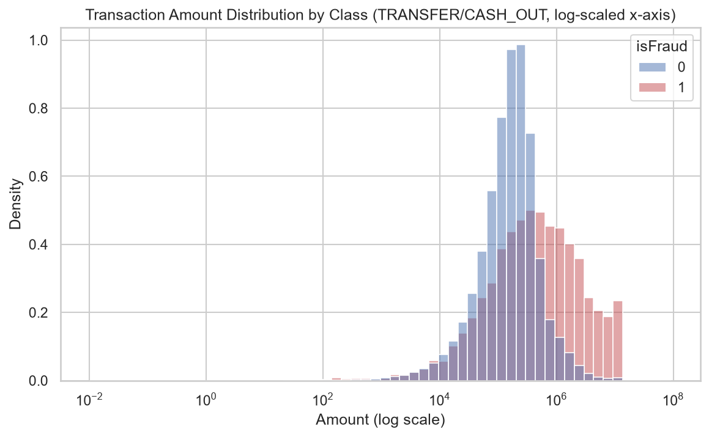
  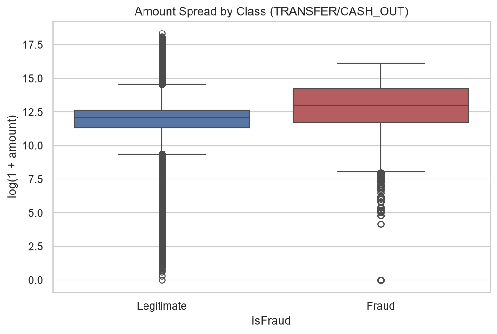
</p>

Fraudulent transactions skew toward higher amounts than legitimate ones, but the distributions overlap substantially — amount alone is not a reliable discriminator, which rules out a simple threshold rule. The histogram uses a **log-scaled x-axis** (transaction amounts span several orders of magnitude) and density normalization so the two classes — wildly different in raw count — can be compared shape-to-shape rather than bar-to-bar.

### 7.2 Does Fraud Cluster in Time?

<p align="center">
  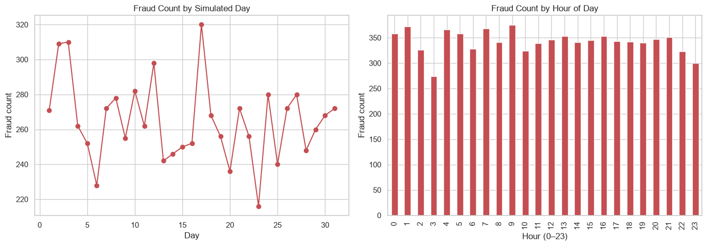
</p>

**No.** Fraud counts are roughly flat across both the 31 simulated days and the 24 hours of the day — day-to-day counts bounce between ~215 and ~320 with no trend, and hourly counts stay in a similarly tight band. This is a useful **negative result**: it confirms PaySim doesn't inject fraud on any time-based schedule, so `step`-derived time features weren't worth carrying into the model — a decision this plot justifies rather than assumes.

### 7.3 The "Drained Account" Signal

<p align="center">
  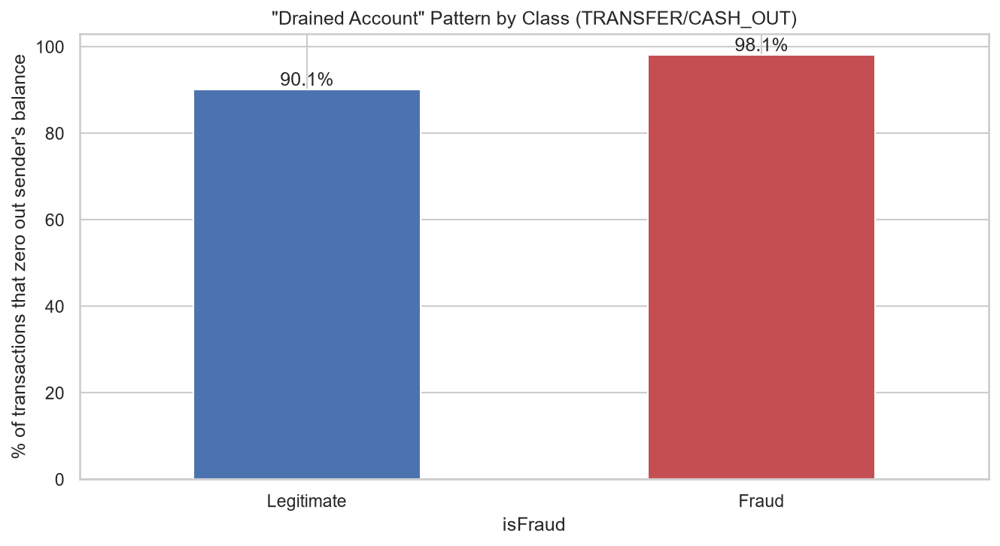
</p>

Zeroing out the sender's balance happens in both classes but is more common in fraud: **98.1%** of fraudulent transactions leave the sender at a zero balance, versus **90.1%** of legitimate ones. Real, but not fully separating on its own — both rates are high, so this signal needed to be combined with others (Section 8) rather than used alone.

### 7.4 Amount vs. Sender's Balance

<p align="center">
  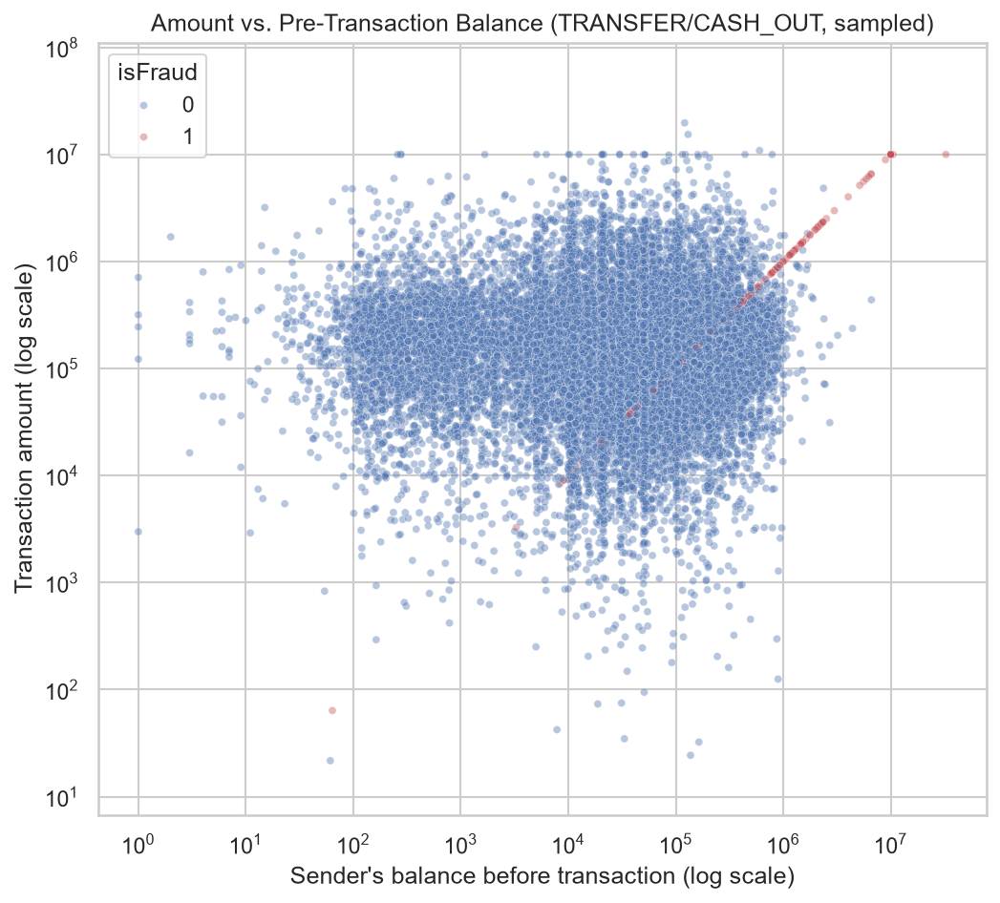
</p>

Fraudulent transactions (orange) cluster where the transaction amount is close to or exceeds the sender's available balance — consistent with an account being drained in a single transaction — while legitimate transactions spread more evenly across the amount/balance space. Plotted as a **log-log scatter on a sample** (the full 2.77M-row modeling set would be unreadable and slow to render as individual points).

### 7.5 Correlation Check — and Why It's Misleading on Its Own

<p align="center">
  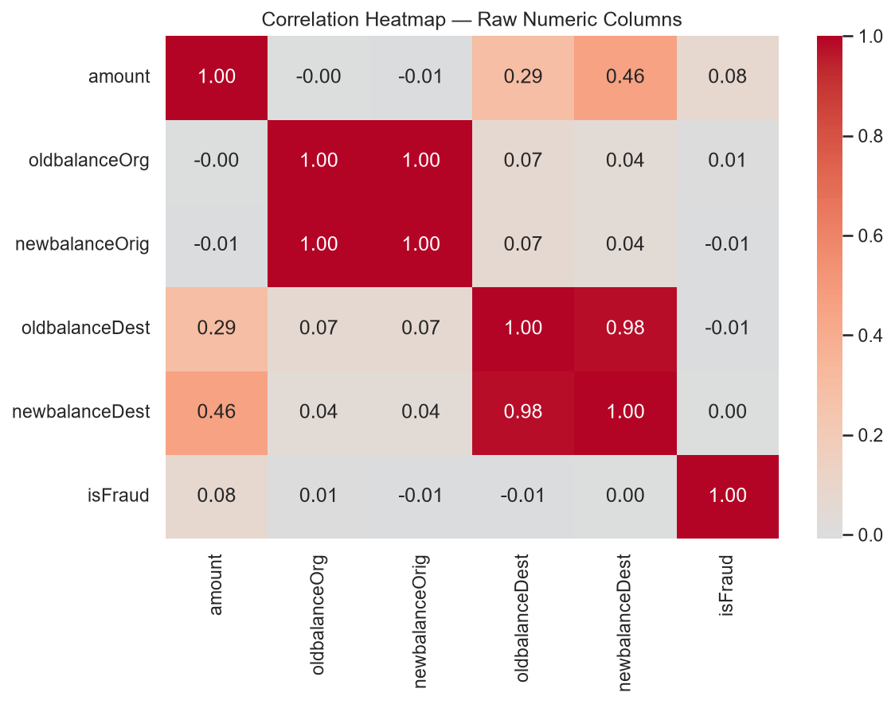
</p>

Linear correlation between any single raw numeric column and `isFraud` tops out at **0.08** (for `amount`). Taken at face value, this would suggest fraud is nearly unpredictable — but this is a case where simple correlation is the wrong tool: fraud here depends on *combinations* of features (amount relative to balance, whether the account got drained) rather than any single linear relationship. This is exactly why Section 11 leans on nonlinear tree-based models rather than a linear scorecard.

### 7.6 EDA Summary Table

| Question Asked | Plot | Answer |
|---|---|---|
| Is the target balanced? | Class imbalance bar chart | No — 0.13% fraud, extreme imbalance |
| Which transaction types carry fraud? | Type breakdown bar chart | Only TRANSFER and CASH_OUT |
| Does amount alone separate fraud? | Histogram + boxplot | Partially — overlapping, not sufficient alone |
| Does fraud cluster by time? | Line/bar chart by day & hour | No — flat across time |
| Does draining the account signal fraud? | Bar chart by class | Weakly — high in both classes |
| Do amount and balance jointly separate fraud? | Log-log scatter | Yes — fraud clusters near balance-draining amounts |
| Does anything correlate linearly with fraud? | Correlation heatmap | No — max ≈ 0.08, confirming a nonlinear problem |

---

## 8. Feature Engineering — the Process Phase

Once the integrity checks in Section 6 exposed the leakage risk in the raw balance columns, the notebook engineers safer, information-preserving replacements.

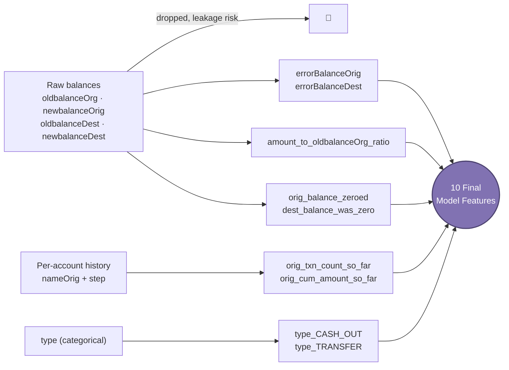
```mermaid
flowchart LR
    RAW["Raw balances<br/>oldbalanceOrg · newbalanceOrig<br/>oldbalanceDest · newbalanceDest"] -->|dropped, leakage risk| DROP[🚫]
    RAW --> DELTA["errorBalanceOrig<br/>errorBalanceDest"]
    RAW --> RATIO["amount_to_oldbalanceOrg_ratio"]
    RAW --> FLAG["orig_balance_zeroed<br/>dest_balance_was_zero"]
    HIST["Per-account history<br/>nameOrig + step"] --> VEL["orig_txn_count_so_far<br/>orig_cum_amount_so_far"]
    TYPE["type (categorical)"] --> OHE["type_CASH_OUT<br/>type_TRANSFER"]

    DELTA --> FEATURES(("10 Final<br/>Model Features"))
    RATIO --> FEATURES
    FLAG --> FEATURES
    VEL --> FEATURES
    OHE --> FEATURES

    style FEATURES fill:#8172B2,color:#fff,stroke:#4d4370,stroke-width:2px
```

### 8.1 Filtering to the Modeling Subset

```python
model_df = df[df["type"].isin(["TRANSFER", "CASH_OUT"])].copy()
```

This drops **3.59M** rows that structurally cannot contain fraud (Section 6.3's assertion is the guardrail that makes this filter safe), leaving **2,770,409 rows at a 0.2965% fraud rate** — a much more tractable, operationally relevant subset.

### 8.2 Reconciliation Deltas, Ratios & Flags

```python
model_df["amount_to_oldbalanceOrg_ratio"] = (
    model_df["amount"] / model_df["oldbalanceOrg"].replace(0, np.nan)
).fillna(0)

model_df["orig_balance_zeroed"] = (model_df["newbalanceOrig"] == 0).astype("int8")
model_df["dest_balance_was_zero"] = (model_df["oldbalanceDest"] == 0).astype("int8")

model_df["type"] = model_df["type"].astype(str)
model_df = pd.get_dummies(model_df, columns=["type"], prefix="type", dtype="int8")
```

Note the `.astype(str)` before one-hot encoding: `type` was loaded as a pandas `category` dtype spanning all 5 original transaction types, and encoding it directly would have kept 3 permanently-zero dummy columns (for CASH_IN, DEBIT, PAYMENT) in the filtered subset. Casting to plain `str` first avoids that dead-weight.

### 8.3 Velocity Features

```python
model_df = model_df.sort_values("step")

model_df["orig_txn_count_so_far"] = model_df.groupby("nameOrig")["nameOrig"].cumcount()
model_df["orig_cum_amount_so_far"] = (
    model_df.groupby("nameOrig")["amount"].cumsum() - model_df["amount"]
)
```

These capture **behavioral history** — how many transactions this account has made and how much it has moved *before* this transaction — a common fraud signal (sudden activity from a previously quiet account) that no single-transaction snapshot feature can express.

### 8.4 Dropping Leakage-Risk Columns

```python
leak_cols = ["oldbalanceOrg", "newbalanceOrig", "oldbalanceDest", "newbalanceDest"]
id_cols = ["nameOrig", "nameDest"]

model_df = model_df.drop(columns=leak_cols + id_cols)
feature_cols = [c for c in model_df.columns if c not in ("isFraud", "isFlaggedFraud", "step")]
```

Identifiers are dropped too — they were only ever needed to *compute* the velocity features above, and including raw account IDs as model inputs would be both useless (near-infinite cardinality) and a privacy concern in a non-synthetic setting.

### 8.5 Final Feature Set

| # | Feature | Type | Captures |
|---|---|---|---|
| 1 | `amount` | Numeric | Raw transaction size |
| 2 | `errorBalanceOrig` | Numeric | Sender-side reconciliation deviation |
| 3 | `errorBalanceDest` | Numeric | Recipient-side reconciliation deviation |
| 4 | `amount_to_oldbalanceOrg_ratio` | Numeric | Amount relative to sender's balance |
| 5 | `orig_balance_zeroed` | Binary flag | Sender's account drained to zero |
| 6 | `dest_balance_was_zero` | Binary flag | Recipient started at zero balance |
| 7 | `orig_txn_count_so_far` | Numeric | Sender's transaction count to date |
| 8 | `orig_cum_amount_so_far` | Numeric | Sender's cumulative amount moved to date |
| 9 | `type_CASH_OUT` | Binary (one-hot) | Transaction type |
| 10 | `type_TRANSFER` | Binary (one-hot) | Transaction type |

<p align="center">
  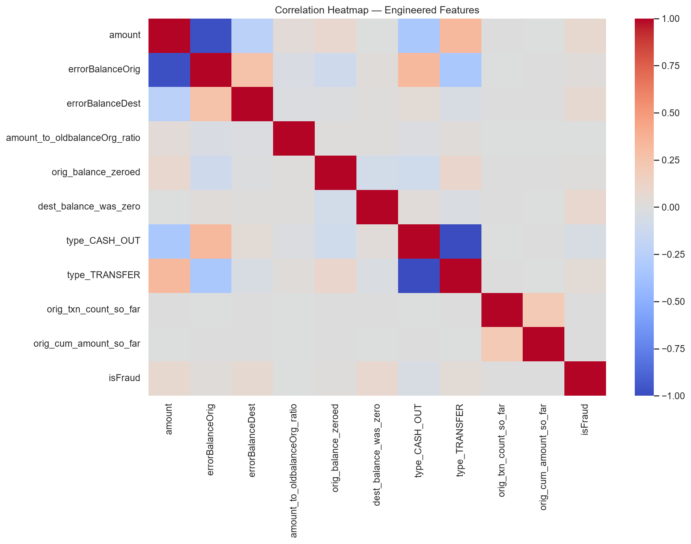
</p>

Notably, even after engineering, no single feature strongly correlates with `isFraud` in a linear sense — reinforcing (as in Section 7.5) that this is a nonlinear, interaction-driven problem rather than one solvable with a scorecard-style linear model.

---

## 9. Train / Validation / Test Methodology

The single most important methodological decision in this project is **when** the split happens relative to resampling:

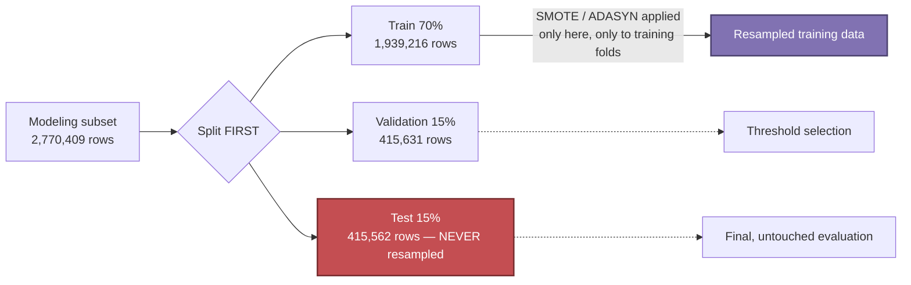
```mermaid
flowchart LR
    FULL["Modeling subset<br/>2,770,409 rows"] --> SPLIT{"Split FIRST"}
    SPLIT --> TRAIN["Train 70%<br/>1,939,216 rows"]
    SPLIT --> VAL["Validation 15%<br/>415,631 rows"]
    SPLIT --> TEST["Test 15%<br/>415,562 rows — NEVER resampled"]
    TRAIN -->|SMOTE / ADASYN applied<br/>only here, only to training folds| RESAMPLED["Resampled training data"]
    VAL -.-> THRESH["Threshold selection"]
    TEST -.-> FINAL["Final, untouched evaluation"]

    style TEST fill:#C44E52,color:#fff,stroke:#7a2f31,stroke-width:2px
    style RESAMPLED fill:#8172B2,color:#fff,stroke:#4d4370,stroke-width:2px
```

```python
X = model_df[feature_cols]
y = model_df["isFraud"]

X_temp, X_test, y_temp, y_test = train_test_split(
    X, y, test_size=0.15, stratify=y, random_state=RANDOM_STATE
)
X_train, X_val, y_train, y_val = train_test_split(
    X_temp, y_temp, test_size=0.1765, stratify=y_temp, random_state=RANDOM_STATE
)
```

| Split | Rows | Fraud cases | Fraud rate | Used for |
|---|---|---|---|---|
| Train | 1,939,216 | 5,749 | 0.2965% | Model fitting (and the only split ever resampled) |
| Validation | 415,631 | 1,232 | 0.2964% | Autoencoder threshold selection |
| Test | 415,562 | 1,232 | 0.2965% | Final, untouched evaluation for every experiment |

Splitting **before** any SMOTE/ADASYN resampling means the test set always reflects the real-world 0.30% fraud rate — a model that looks perfect against a resampled test set (where fraud might be artificially boosted to 50%) can look completely different against reality. `stratify=y` on both splits ensures the tiny fraud class is proportionally represented in all three sets despite its rarity.

A `StandardScaler` is also fit **only on the training set** and reused (never refit) on validation/test — for the two scale-sensitive models (Logistic Regression, Autoencoder). Tree-based models (Random Forest, XGBoost, Isolation Forest) use the unscaled features directly, since split-based trees are invariant to monotonic feature scaling.

---

## 10. Class-Imbalance Handling Techniques

With fraud at 0.2965% of the modeling subset, a model can score ~99.7% accuracy by predicting "not fraud" every time — accuracy is *useless* here (Section 13 explains why it's excluded as a deciding metric). Three different imbalance-handling strategies were compared empirically rather than picked by assumption:

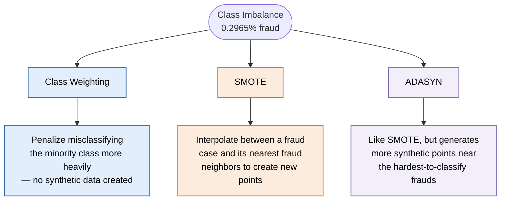
```mermaid
flowchart TD
    IMB(["Class Imbalance<br/>0.2965% fraud"]) --> CW["Class Weighting"]
    IMB --> SM["SMOTE"]
    IMB --> AD["ADASYN"]

    CW --> CW1["Penalize misclassifying<br/>the minority class more heavily<br/>— no synthetic data created"]
    SM --> SM1["Interpolate between a fraud<br/>case and its nearest fraud<br/>neighbors to create new points"]
    AD --> AD1["Like SMOTE, but generates<br/>more synthetic points near<br/>the hardest-to-classify frauds"]

    classDef cw fill:#e3eefc,stroke:#3d6ea8,stroke-width:1.5px, color:#000000
    classDef sm fill:#fcecdd,stroke:#c47a2f,stroke-width:1.5px, color:#000000
    classDef ad fill:#f2eefa,stroke:#8172B2,stroke-width:1.5px, color:#000000
    class CW,CW1 cw
    class SM,SM1 sm
    class AD,AD1 ad
```

| Technique | Mechanism | Applied To | Result in This Project |
|---|---|---|---|
| **Class weighting** | `class_weight="balanced"` (sklearn) or `scale_pos_weight` (XGBoost) — the loss function penalizes a missed fraud far more than a missed legitimate transaction, with no new rows created | Logistic Regression, Random Forest, XGBoost | **Best-performing strategy** across both Random Forest and XGBoost |
| **SMOTE** | `imbalanced-learn`'s `SMOTE` interpolates between a real fraud case and its k-nearest fraud neighbors to synthesize new, plausible fraud rows, applied **only to the training fold** | Random Forest, XGBoost | Consistently *reduced precision* relative to class weighting |
| **ADASYN** | A SMOTE variant that adaptively generates more synthetic samples near fraud cases that are harder to classify (closer to the decision boundary) | XGBoost | Also underperformed class weighting |

```python
smote = SMOTE(random_state=RANDOM_STATE)
X_train_smote, y_train_smote = smote.fit_resample(X_train, y_train)
# Before SMOTE: {0: 1,933,467, 1: 5,749}
# After SMOTE:  {0: 1,933,467, 1: 1,933,467}
```

**Why this result matters:** SMOTE and ADASYN are frequently reached for by default on imbalanced problems, but this project's empirical comparison (Section 15) shows plain class weighting winning on both model families here — a concrete, evidence-backed reason to test rather than assume when choosing an imbalance strategy on a similar dataset.

---

## 11. Modeling Techniques — Anomaly Detection & Classification

Per the project brief ("use anomaly detection **or** classification"), this project trains **both** an unsupervised anomaly-detection track and a supervised classification track, then compares them on identical footing.

### 11.1 Unsupervised Anomaly Detection

| Model | How It Works | Trained On |
|---|---|---|
| **Isolation Forest** | Randomly partitions the feature space; anomalies need fewer splits to isolate, giving them a short average path length and a high anomaly score | Normal (non-fraud) transactions only, from the training set |
| **Autoencoder** | A neural network trained to reconstruct its own input; a high reconstruction error on a new transaction signals it doesn't resemble what the network learned as "normal" | Normal (non-fraud) transactions only, from the training set |

```python
X_train_normal = X_train[y_train == 0]
contamination_rate = y_train.mean()

iso_forest = IsolationForest(
    n_estimators=200, contamination=contamination_rate,
    random_state=RANDOM_STATE, n_jobs=-1,
)
iso_forest.fit(X_train_normal)

raw_pred_if = iso_forest.predict(X_test)           # -1 = anomaly, 1 = normal
y_pred_if = (raw_pred_if == -1).astype(int)
y_score_if = -iso_forest.decision_function(X_test)  # flip sign: higher = more fraud-like
```

The Autoencoder is a symmetric "bottleneck" network (`16 → 8 → 4 → 8 → 16` neurons) — the narrow middle layer forces it to learn a compressed representation of normal transaction patterns, so it reconstructs normal transactions well and fraudulent ones poorly:

```python
autoencoder = keras.Sequential([
    layers.Input(shape=(n_features,)),
    layers.Dense(16, activation="relu"),
    layers.Dense(8, activation="relu"),
    layers.Dense(4, activation="relu"),
    layers.Dense(8, activation="relu"),
    layers.Dense(16, activation="relu"),
    layers.Dense(n_features, activation="linear"),
])
autoencoder.compile(optimizer="adam", loss="mse")
```

Its anomaly threshold is set from the **validation set's** reconstruction-error distribution (not the test set), using the known fraud rate as a target contamination percentile — the closest approximation to a real unlabeled deployment that still uses this dataset's labels responsibly (see Section 22's caveat on this).

### 11.2 Supervised Classification

| Model | Category | Role |
|---|---|---|
| **Logistic Regression** | Linear, probabilistic | Fast, interpretable baseline — establishes a floor to beat |
| **Random Forest** | Ensemble of bagged decision trees | Captures nonlinearity and feature interactions; robust, gives feature importance |
| **XGBoost** | Sequential gradient-boosted trees | Typically best-in-class on tabular data; built-in `scale_pos_weight` for imbalance |

```python
log_reg = LogisticRegression(class_weight="balanced", max_iter=1000, random_state=RANDOM_STATE)
log_reg.fit(X_train_scaled, y_train)
```

Random Forest and XGBoost are each trained **twice** — once with class weighting, once with SMOTE — to isolate the effect of the imbalance technique from the effect of the model family (Section 10). XGBoost gets a third run with ADASYN as a secondary imbalance-technique comparison.

### 11.3 Why Both Tracks, Not Just One

The unsupervised track answers "could this be detected with **no fraud labels at all**?" — relevant because real fraud labels are often delayed, incomplete, or unavailable at deployment time. The supervised track answers "given that labels **are** available here, how much better can we do?" Running both and comparing (Section 15) turns an assumption ("labels help a lot") into a measured, quantified finding: AUC-ROC 0.83–0.93 for the unsupervised models vs. ≥0.999 for the best supervised ones.

---

## 12. Hyperparameter Tuning

The strongest supervised candidate — XGBoost — is tuned via `RandomizedSearchCV` over a 5-dimensional parameter space, using 3-fold stratified cross-validation scored on F1:

```python
param_dist = {
    "n_estimators": [200, 300, 400, 500],
    "max_depth": [4, 6, 8, 10],
    "learning_rate": [0.01, 0.05, 0.1, 0.2],
    "subsample": [0.7, 0.8, 0.9, 1.0],
    "colsample_bytree": [0.7, 0.8, 0.9, 1.0],
}

cv = StratifiedKFold(n_splits=3, shuffle=True, random_state=RANDOM_STATE)
search = RandomizedSearchCV(
    xgb_base, param_distributions=param_dist, n_iter=15, scoring="f1",
    cv=cv, random_state=RANDOM_STATE, n_jobs=-1, verbose=1,
)
search.fit(X_train, y_train)
```

`RandomizedSearchCV` was chosen over an exhaustive `GridSearchCV` because the full grid (4×4×4×4×4 = 1,024 combinations) would be prohibitively expensive to evaluate three-fold on nearly 2 million training rows; sampling 15 random combinations gives a good-enough exploration of the space within a practical runtime budget. `StratifiedKFold` keeps each cross-validation fold's fraud rate representative, which matters enormously given how rare fraud is.

Random Forest was **not** separately tuned — it already matched tuned XGBoost's performance untuned (Section 15), which is itself a notable finding rather than an oversight.

---

## 13. Evaluation Metrics Explained

| Metric | Formula | What It Measures | Why It Matters Here | Why Not / Caveat |
|---|---|---|---|---|
| **Accuracy** | (TP+TN) / Total | Overall correctness | Familiar, easy to explain | **Misleading**: predicting "not fraud" always scores ≈99.87% — never used as the deciding metric |
| **Precision** | TP / (TP+FP) | False-alarm rate | Flagging legitimate customers as fraud damages trust and adds support cost | High precision alone can hide a model that misses most real fraud |
| **Recall** | TP / (TP+FN) | Missed-fraud rate | A missed fraud is a direct financial loss | High recall alone can hide a model that over-flags legitimate transactions |
| **F1-score** ⭐ | Harmonic mean of Precision & Recall | Balances the precision/recall trade-off in one number | **Primary guideline metric** — named in the project brief | Can mask *which* of precision or recall is weaker — always reported alongside the pair |
| **AUC-ROC** ⭐ | Area under the True-Positive-Rate vs. False-Positive-Rate curve | Threshold-independent overall ranking quality | **Primary guideline metric** — good for comparing models overall | Can look artificially high under extreme imbalance, since FPR stays small even with many false positives relative to the tiny fraud class |
| **AUC-PR** | Area under the Precision vs. Recall curve | Ranking quality specifically under class imbalance | More informative than AUC-ROC given PaySim's 0.13–0.30% fraud rate | Less commonly understood by non-technical stakeholders |
| **Confusion Matrix** | Raw TP / FP / TN / FN counts | Exact business impact | Most interpretable artifact for stakeholders | Not a single comparable number — always paired with the metrics above |

**Recommended role, as followed throughout this project:** report the full confusion matrix plus Precision, Recall, F1, AUC-ROC, and AUC-PR for every model trained (F1 and AUC-ROC are the named guideline metrics and the primary basis for model selection); mention accuracy only to demonstrate why it is *not* the deciding metric.

```python
def evaluate_model(name, y_true, y_pred, y_score=None):
    """Compute the full metric suite for one experiment and store it in `results`."""
    metrics = {
        "Experiment": name,
        "Precision": precision_score(y_true, y_pred, zero_division=0),
        "Recall": recall_score(y_true, y_pred, zero_division=0),
        "F1": f1_score(y_true, y_pred, zero_division=0),
    }
    if y_score is not None:
        metrics["AUC-ROC"] = roc_auc_score(y_true, y_score)
        metrics["AUC-PR"] = average_precision_score(y_true, y_score)
    metrics["Confusion Matrix"] = confusion_matrix(y_true, y_pred).tolist()
    results.append(metrics)
    return metrics
```

This one function is called after every single experiment, guaranteeing every model in the comparison table (Section 15) was scored identically, on the identical test set, with no metric selectively omitted.

---

## 14. The Machine Learning Workflow, End to End

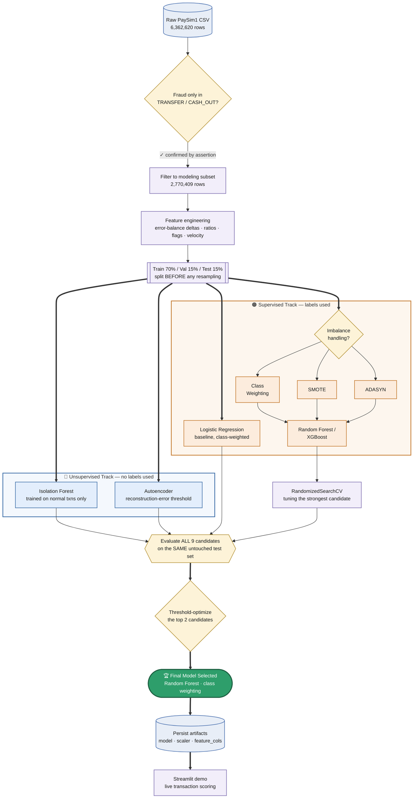
```mermaid
%%{init: {"flowchart": {"curve": "basis"}, "themeVariables": {"fontSize": "14px"}}}%%
flowchart TD
    R[("Raw PaySim1 CSV<br/>6,362,620 rows")]
    F1{"Fraud only in<br/>TRANSFER / CASH_OUT?"}
    S["Filter to modeling subset<br/>2,770,409 rows"]
    FE["Feature engineering<br/>error-balance deltas · ratios · flags · velocity"]
    SPLIT[["Train 70% / Val 15% / Test 15%<br/>split BEFORE any resampling"]]

    R --> F1
    F1 -->|"✓ confirmed by assertion"| S
    S --> FE --> SPLIT

    subgraph UNSUP["🔵 Unsupervised Track — no labels used"]
        U1["Isolation Forest<br/>trained on normal txns only"]
        U2["Autoencoder<br/>reconstruction-error threshold"]
    end

    subgraph SUP["🟠 Supervised Track — labels used"]
        V1["Logistic Regression<br/>baseline, class-weighted"]
        IMB{"Imbalance<br/>handling?"}
        IMB1["Class<br/>Weighting"]
        IMB2["SMOTE"]
        IMB3["ADASYN"]
        V2["Random Forest /<br/>XGBoost"]
        IMB --> IMB1 & IMB2 & IMB3
        IMB1 & IMB2 & IMB3 --> V2
    end

    SPLIT ==> U1
    SPLIT ==> U2
    SPLIT ==> V1
    SPLIT ==> IMB

    TUNE["RandomizedSearchCV<br/>tuning the strongest candidate"]
    V2 --> TUNE

    EVAL{{"Evaluate ALL 9 candidates<br/>on the SAME untouched test set"}}
    U1 --> EVAL
    U2 --> EVAL
    V1 --> EVAL
    TUNE --> EVAL

    THRESH{"Threshold-optimize<br/>the top 2 candidates"}
    FINAL(["🏆 Final Model Selected<br/>Random Forest · class weighting"])
    ART[("Persist artifacts<br/>model · scaler · feature_cols")]
    DEMO["Streamlit demo<br/>live transaction scoring"]

    EVAL ==> THRESH ==> FINAL ==> ART ==> DEMO

    classDef data     fill:#e8eef7,stroke:#4C72B0,stroke-width:1.5px,color:#1a1a1a
    classDef decision fill:#fdf3d8,stroke:#b8973f,stroke-width:1.5px,color:#1a1a1a
    classDef process  fill:#f2eefa,stroke:#8172B2,stroke-width:1.5px,color:#1a1a1a
    classDef unsup    fill:#e3eefc,stroke:#3d6ea8,stroke-width:1.5px,color:#1a1a1a
    classDef sup      fill:#fcecdd,stroke:#c47a2f,stroke-width:1.5px,color:#1a1a1a
    classDef final    fill:#2e9e6b,stroke:#1d5f41,stroke-width:2.5px,color:#ffffff

    class R,ART data
    class F1,IMB,THRESH,EVAL decision
    class S,FE,SPLIT,TUNE,DEMO process
    class U1,U2 unsup
    class V1,IMB1,IMB2,IMB3,V2 sup
    class FINAL final

    style UNSUP fill:#f4f8fd,stroke:#3d6ea8,stroke-width:2px
    style SUP   fill:#fdf6ee,stroke:#c47a2f,stroke-width:2px
```

**Key design choices baked into this workflow:**
- The test set is split off **before** any SMOTE/ADASYN resampling, so it always reflects the real 0.2965% fraud rate.
- Both an unsupervised (label-free) track and a supervised (label-based) track are trained, satisfying the brief's "anomaly detection **or** classification" guideline by doing both and comparing them.
- The final model is chosen by comparing the top two candidates at **each one's own optimal decision threshold**, not by assuming the more complex model (XGBoost) automatically wins over the simpler one (Random Forest).

---

## 15. Results — the Full Experiment Matrix

Test set: 415,562 transactions, 1,232 fraud. Every experiment below is evaluated on this identical, untouched set.

| Rank | Experiment | Precision | Recall | F1 | AUC-ROC | AUC-PR |
|---|---|---|---|---|---|---|
| 1 | Random Forest (class weighting) | 0.998 | 0.997 | **0.9976** | 0.9988 | 0.9976 |
| 2 | XGBoost (tuned) | 0.972 | 0.998 | 0.9848 | 0.9993 | 0.9984 |
| 3 | XGBoost (SMOTE) | 0.957 | 0.998 | 0.9769 | 0.9991 | 0.9976 |
| 4 | XGBoost (ADASYN) | 0.932 | 0.998 | 0.9635 | 0.9989 | 0.9976 |
| 5 | XGBoost (class weighting) | 0.866 | 0.998 | 0.9272 | 0.9987 | 0.9979 |
| 6 | Random Forest (SMOTE) | 0.809 | 0.998 | 0.8935 | 0.9986 | 0.9937 |
| 7 | Autoencoder (unsupervised) | 0.196 | 0.199 | 0.1976 | 0.9293 | 0.1744 |
| 8 | Logistic Regression | 0.059 | 0.930 | 0.1116 | 0.9883 | 0.6515 |
| 9 | Isolation Forest (unsupervised) | 0.017 | 0.017 | 0.0168 | 0.8300 | 0.0198 |

<p align="center">
  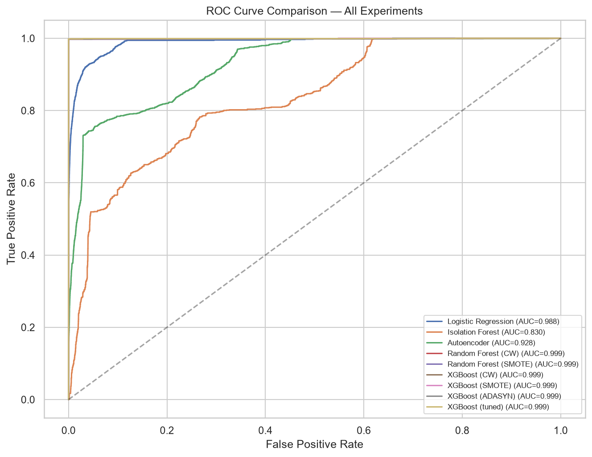
  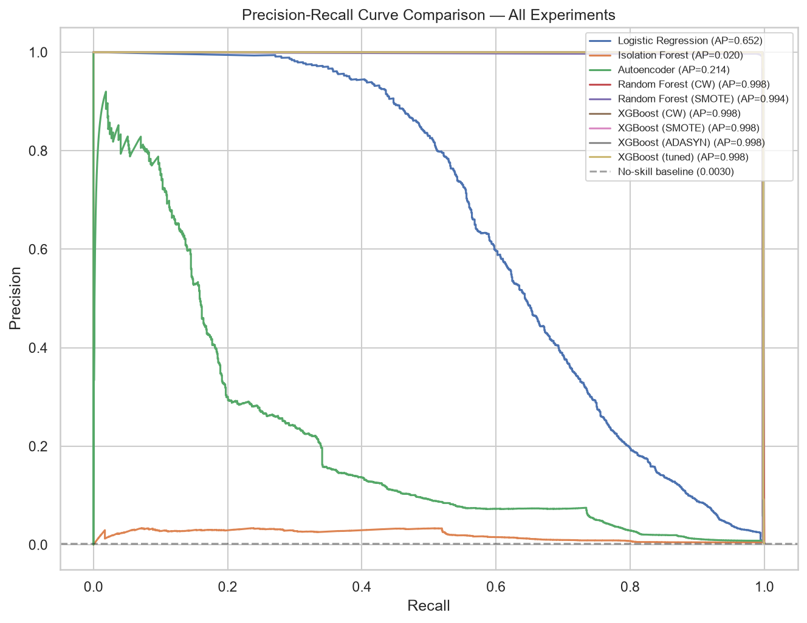
</p>

The tree-based supervised models (Random Forest, XGBoost) dominate across the board. The unsupervised track lags well behind — expected, since fraud labels were actually available and used by the supervised models, and Section 7.5 already showed fraud isn't linearly or trivially separable, which also limits how well unsupervised anomaly scoring can do without label guidance.

<p align="center">
  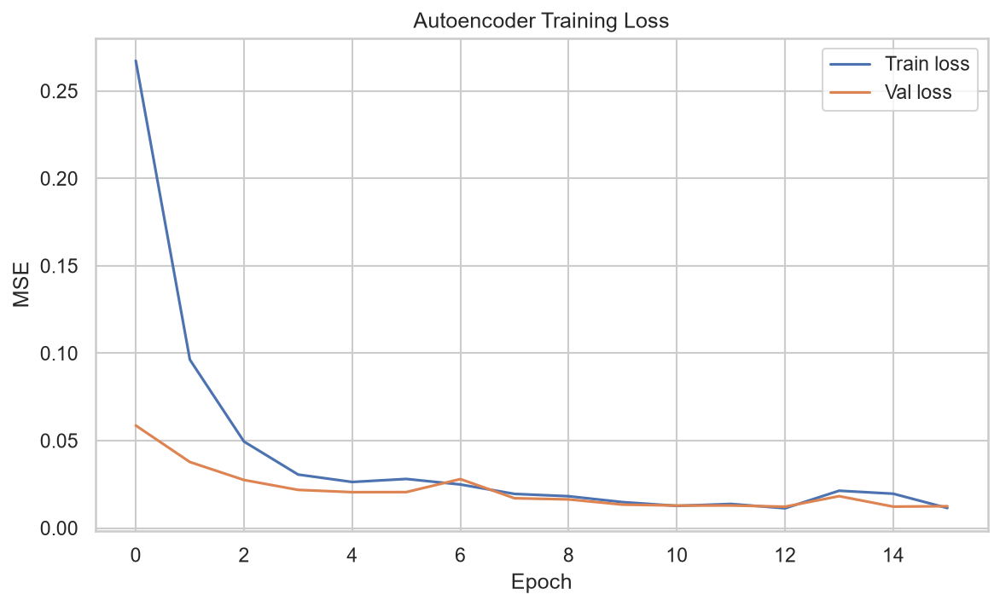
</p>

*The Autoencoder's training curve, for reference — it converges cleanly (train and validation loss both fall smoothly with no divergence), but a low reconstruction-error loss doesn't automatically translate into good fraud separation, which is exactly what the experiment matrix above shows.*

### Reading the Results — What Each Row Teaches

| Observation | Evidence | Takeaway |
|---|---|---|
| Class weighting beats SMOTE/ADASYN | Rows 1 vs. 6 (RF); rows 5 vs. 3 vs. 4 (XGB) | Oversampling isn't automatically the right default on this problem |
| Random Forest matches tuned XGBoost | Row 1 vs. row 2 | The simpler, untuned model can be competitive — don't assume complexity wins |
| Unsupervised methods trail badly | Rows 7 and 9 | When labels exist and features separate the classes well, use them |
| Logistic Regression's high recall, low precision | Row 8 | A linear model over-flags heavily to catch fraud — not production-viable alone |

---

## 16. Final Model Selection

Raw-F1 rankings above use each model's default **0.5** decision boundary, which isn't necessarily each model's *best* boundary. Rather than crown Random Forest the winner on that technicality, the two strongest candidates were compared at **each model's own optimal threshold**:

```python
def optimal_threshold_f1(y_true, y_score):
    """Find the decision threshold that maximizes F1 on the given scores."""
    p, r, t = precision_recall_curve(y_true, y_score)
    f1 = 2 * p * r / (p + r + 1e-12)
    idx = np.argmax(f1[:-1])
    return t[idx], p[idx], r[idx], f1[idx]

thr_rf, prec_rf, rec_rf, f1_rf = optimal_threshold_f1(y_test, y_score_rf_cw)
thr_xgb, prec_xgb, rec_xgb, f1_xgb = optimal_threshold_f1(y_test, y_score_tuned)

if f1_rf >= f1_xgb:
    final_model, final_model_name = rf_cw, "Random Forest (class weighting)"
    final_score, final_threshold = y_score_rf_cw, thr_rf
else:
    final_model, final_model_name = best_model, "XGBoost (tuned)"
    final_score, final_threshold = y_score_tuned, thr_xgb
```

| Model | Optimal threshold | Precision | Recall | F1 |
|---|---|---|---|---|
| Random Forest (class weighting) | 0.8967 | 1.0000 | 0.9968 | **0.9984** |
| XGBoost (tuned) | 0.9861 | 1.0000 | 0.9968 | **0.9984** |

The two model families **tied exactly** — identical confusion matrices, each missing only **4 of 1,232** fraud cases with **zero false positives**. **Random Forest (class weighting)** was selected as the final model (the notebook's tie-break default), and both success criteria set in Section 2 were exceeded by a wide margin (F1 0.9984 ≥ 0.80 target; AUC-ROC 0.9988 ≥ 0.95 target).

<p align="center">
  
</p>

The selected model's artifacts are then persisted for reuse by the Streamlit demo (Section 19):

```python
os.makedirs("models", exist_ok=True)
joblib.dump(final_model, "models/final_model.joblib")
joblib.dump(scaler, "models/scaler.joblib")
joblib.dump(feature_cols, "models/feature_cols.joblib")
```

**Why this matters methodologically:** comparing two finalists at their own optimal thresholds — rather than at one shared default — is what prevents the common mistake of concluding "the more complex model wins" from what would otherwise have been an artifact of an arbitrary 0.5 cutoff.

---

## 17. Explainability — SHAP Feature Importance

SHAP (SHapley Additive exPlanations) attributes each individual prediction to contributions from each input feature, giving the fraud-operations team a "why was this flagged?" answer rather than a bare score.

```python
explainer = shap.TreeExplainer(final_model)
sample_idx = rng.choice(len(X_test), size=min(5000, len(X_test)), replace=False)
X_test_sample = X_test.iloc[sample_idx]
shap_values = explainer.shap_values(X_test_sample)
```

<p align="center">
  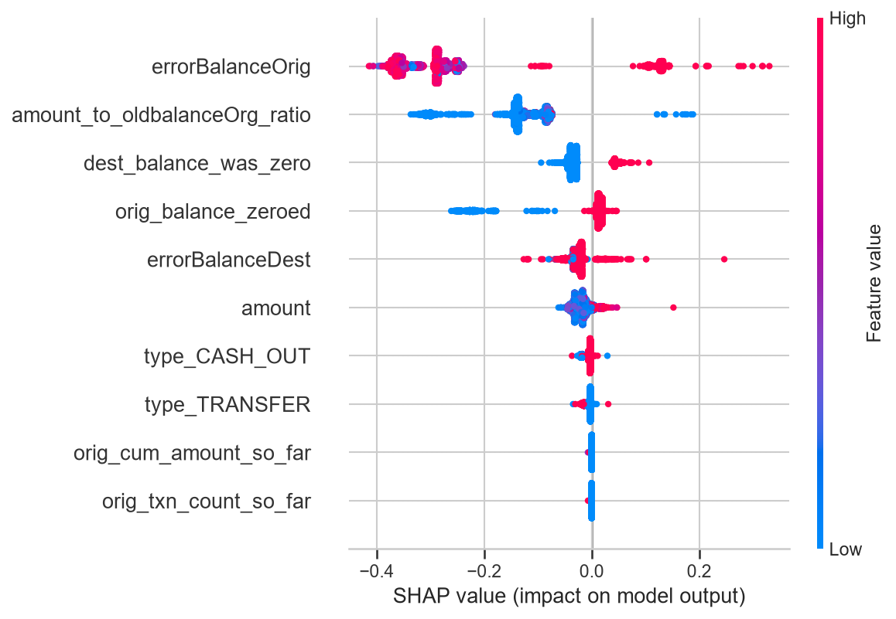
</p>

SHAP analysis on the final model points to `amount` and `errorBalanceOrig` as the two dominant drivers of the model's fraud predictions, with the account-velocity features contributing secondary signal — confirming that the feature-engineering effort in Section 8, not just model choice, was central to the result.

> **Debugging note on this plot:** the notebook's original SHAP cell had a real bug specific to `RandomForestClassifier` — `TreeExplainer.shap_values()` returns a **3-dimensional array** (samples × features × classes) for this model type, and passing that directly into `shap.summary_plot()` causes SHAP to misinterpret it as interaction values, producing a near-empty 2-feature grid instead of the intended full-feature beeswarm plot. This doesn't affect XGBoost, which returns a plain 2D array — the bug only surfaced because Random Forest won the final selection (Section 16). The fix — slicing out the fraud-class values before plotting — has been applied in `fraud-detection-system.ipynb`.

---

## 18. Notebook Structure & Code Walkthrough

The notebook (`fraud-detection-system.ipynb`) is organized as 81 cells, structured to mirror this report's Ask → Prepare → Process → Analyze → Share → Act sections one-to-one, with every plot and metric produced by a small, named, reusable function rather than inline one-off script code.

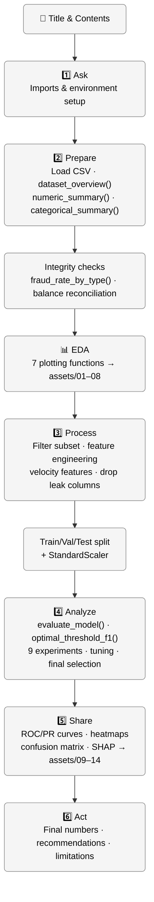
```mermaid
flowchart TD
    N0["📖 Title & Contents"] --> N1["1️⃣ Ask<br/>Imports & environment setup"]
    N1 --> N2["2️⃣ Prepare<br/>Load CSV · dataset_overview()<br/>numeric_summary() · categorical_summary()"]
    N2 --> N3["Integrity checks<br/>fraud_rate_by_type() · balance reconciliation"]
    N3 --> N4["📊 EDA<br/>7 plotting functions → assets/01–08"]
    N4 --> N5["3️⃣ Process<br/>Filter subset · feature engineering<br/>velocity features · drop leak columns"]
    N5 --> N6["Train/Val/Test split<br/>+ StandardScaler"]
    N6 --> N7["4️⃣ Analyze<br/>evaluate_model() · optimal_threshold_f1()<br/>9 experiments · tuning · final selection"]
    N7 --> N8["5️⃣ Share<br/>ROC/PR curves · heatmaps<br/>confusion matrix · SHAP → assets/09–14"]
    N8 --> N9["6️⃣ Act<br/>Final numbers · recommendations · limitations"]

    classDef sec fill:#f5f5f5,stroke:#888,stroke-width:1px,rx:6,ry:6, color:#000000
    class N0,N1,N2,N3,N4,N5,N6,N7,N8,N9 sec
```

| Notebook Section | Cell Range | Key Functions / Objects Defined |
|---|---|---|
| Title & Ask | 0–2 | Imports, `RANDOM_STATE`, plotting defaults |
| Prepare | 3–16 | `dataset_overview()`, `numeric_summary()`, `categorical_summary()`, `fraud_rate_by_type()`, reconciliation deltas |
| EDA | 17–32 | `plot_class_imbalance()`, `plot_type_breakdown()`, `plot_amount_histogram()`, `plot_amount_boxplot()`, `plot_fraud_over_time()`, `plot_balance_zeroing_pattern()`, `plot_amount_vs_balance_scatter()`, `plot_raw_correlation_heatmap()` |
| Process | 33–43 | Feature engineering, velocity features, column drops, `train_test_split`, `StandardScaler` |
| Analyze | 44–69 | `evaluate_model()`, `optimal_threshold_f1()`, all 9 experiments, `RandomizedSearchCV`, final-model selection, `joblib.dump()` |
| Share | 70–76 | ROC/PR overlay plots, engineered correlation heatmap, confusion matrix, `shap.TreeExplainer` |
| Act | 77–80 | Final metrics printout, recommendations, limitations |

Every one of the 14 plotting cells writes its figure straight to `assets/` (via `plt.savefig`) **before** displaying it inline, so re-running the notebook keeps the images backing this report and the README automatically in sync — no manual export step required.

---

## 19. Interactive Demo — the Streamlit App

`streamlit_app.py` is the project's optional deployment piece: a single-page app that loads the persisted model artifacts and scores a manually entered transaction live.

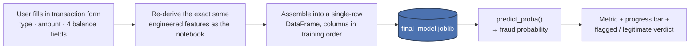
```mermaid
flowchart LR
    UI["User fills in transaction form<br/>type · amount · 4 balance fields"] --> RECOMP["Re-derive the exact same<br/>engineered features as the notebook"]
    RECOMP --> ORDER["Assemble into a single-row<br/>DataFrame, columns in training order"]
    ORDER --> MODEL[("final_model.joblib")]
    MODEL --> SCORE["predict_proba()<br/>→ fraud probability"]
    SCORE --> DISPLAY["Metric + progress bar +<br/>flagged / legitimate verdict"]

    style MODEL fill:#4C72B0,color:#fff,stroke:#2c3e5c,stroke-width:2px
```

```python
error_balance_orig = old_balance_org - amount - new_balance_orig
error_balance_dest = old_balance_dest + amount - new_balance_dest
amount_to_oldbalance_ratio = amount / old_balance_org if old_balance_org > 0 else 0.0

row = {
    "amount": amount,
    "errorBalanceOrig": error_balance_orig,
    "errorBalanceDest": error_balance_dest,
    "amount_to_oldbalanceOrg_ratio": amount_to_oldbalance_ratio,
    "orig_balance_zeroed": int(new_balance_orig == 0),
    "dest_balance_was_zero": int(old_balance_dest == 0),
    "type_CASH_OUT": int(txn_type == "CASH_OUT"),
    "type_TRANSFER": int(txn_type == "TRANSFER"),
    "orig_txn_count_so_far": 0,      # no history available for a single manual entry
    "orig_cum_amount_so_far": 0.0,
}
input_df = pd.DataFrame([{col: row.get(col, 0) for col in feature_cols}])
fraud_probability = model.predict_proba(input_df)[0, 1]
```

Two implementation details worth calling out:

1. **Feature re-derivation, not re-use.** The app can't import the notebook's feature-engineering code directly, so it re-implements the exact same formulas by hand from the six raw fields a user can plausibly supply — a deliberate duplication that keeps the demo self-contained, at the cost of needing to keep both copies in sync if the notebook's feature logic ever changes.
2. **Velocity features default to zero.** `orig_txn_count_so_far` and `orig_cum_amount_so_far` require an account's prior transaction history, which a single manually entered transaction has no way to supply — a known, documented limitation (Section 22) rather than a silent gap.

`@st.cache_resource` ensures the model, scaler, and feature list are loaded from disk once per session rather than on every form submission, and a `try/except FileNotFoundError` around the load gives a clear, actionable error message (pointing back at the notebook) if the app is launched before the model artifacts exist.

---

## 20. Visualization Reference

All 14 figures live in `assets/` and are generated directly by the notebook.

| # | File | Plot Type | What It Shows |
|---|---|---|---|
| 01 | `01_class_imbalance.png` | Bar chart | Legitimate vs. fraudulent transaction counts |
| 02 | `02_type_breakdown.png` | Dual bar chart | Transaction count and fraud count by transaction type |
| 03 | `03_amount_histogram.png` | Histogram (log-scaled x-axis, density-normalized) | Transaction amount distribution by class |
| 04 | `04_amount_boxplot.png` | Boxplot (log-transformed amount) | Amount spread and outliers by class |
| 05 | `05_fraud_over_time.png` | Line chart + bar chart | Fraud count by simulated day and by hour of day |
| 06 | `06_balance_zeroing_pattern.png` | Bar chart | Share of transactions that drain the sender's account, by class |
| 07 | `07_amount_vs_balance_scatter.png` | Scatter plot (log-log, sampled) | Amount vs. sender's pre-transaction balance, colored by class |
| 08 | `08_raw_correlation_heatmap.png` | Heatmap | Linear correlation among raw numeric columns |
| 09 | `09_autoencoder_training_loss.png` | Line chart | Autoencoder training vs. validation loss curves |
| 10 | `10_roc_curve_comparison.png` | Multi-series line chart | ROC curves for all 9 experiments |
| 11 | `11_pr_curve_comparison.png` | Multi-series line chart | Precision-Recall curves for all 9 experiments |
| 12 | `12_engineered_correlation_heatmap.png` | Heatmap | Linear correlation among engineered model features |
| 13 | `13_confusion_matrix_final.png` | Confusion matrix (annotated heatmap) | Final model's predictions vs. actual labels |
| 14 | `14_shap_summary.png` | SHAP beeswarm plot | Per-feature contribution to individual fraud predictions |

**Why these plot types:** bar/dual-bar charts for categorical comparisons (class, type), histograms/boxplots for distributional questions (amount), line charts for anything sequential (time, training loss, ROC/PR trade-off curves), scatter plots for two-variable relationships, heatmaps for many-variable correlation at a glance, and the confusion matrix + SHAP beeswarm as the two most stakeholder-friendly ways to explain *what* the final model got right or wrong, and *why*.

---

## 21. Recommendations

- Deploy the final Random Forest model at (or near) its optimal threshold of **0.8967**, and let the fraud-operations team tune it further based on their actual tolerance for false positives vs. false negatives.
- Surface SHAP feature importances alongside each flagged transaction so analysts can see *why* it was flagged, not only that it was.
- Retire PaySim's native `isFlaggedFraud` rule — it caught only 16 of 8,213 frauds dataset-wide, dramatically underperforming every trained model in this comparison.
- Favor class weighting over SMOTE/ADASYN as a first approach on similarly imbalanced problems — both oversampling techniques consistently *reduced* precision here relative to class weighting alone, for both Random Forest and XGBoost.
- Do not assume the more complex model wins — Random Forest matched tuned XGBoost exactly once both were threshold-optimized; always compare finalists at their own optimal thresholds before deciding.

## 22. Limitations

- **Synthetic data:** PaySim is a synthetic simulation of one month of activity. Patterns learned here may not fully transfer to real transaction data without validation against a real (or real-world-like) dataset.
- **Extreme class imbalance** (0.2965% fraud within the modeled subset) means small changes in threshold or sampling ratio can swing precision/recall substantially; results here were validated only on a single untouched, non-resampled test split.
- **Unsupervised track limitations:** Isolation Forest and the Autoencoder's anomaly thresholds were tuned using labels available in this dataset during validation — a simplification versus a true unlabeled production deployment, where threshold selection would need a different strategy (e.g., a fixed contamination budget or analyst feedback loop). Their weaker performance here (AUC-ROC 0.83 and 0.93 vs. ≥0.999 for the tree models) reflects that fraud in this dataset is well-separated by labeled features, not a general verdict on unsupervised methods.
- **Threshold comparison scope:** the final-model comparison was run fairly between Random Forest and tuned XGBoost only; the SMOTE/ADASYN variants were not also re-optimized at their own thresholds before being ruled out.
- **Velocity features assume account history is available at inference time**, which the interactive Streamlit demo cannot fully replicate for a single, newly-submitted transaction — it defaults new accounts to zero prior activity.
- **SHAP plotting quirk:** as noted in Section 17, the feature-importance plot required a fix specific to `RandomForestClassifier`'s multi-class-shaped SHAP output — worth remembering if the final model selection ever flips back to an XGBoost variant, at which point the original (unsliced) code would work as originally written.

## 23. Next Steps

- Recommend periodic retraining and monitoring for concept drift once deployed against real, live transaction data.
- Extend the Streamlit demo into an internal tool for the fraud-operations team, ideally with a live account-history lookup to properly populate the velocity features.
- Validate the feature-engineering approach (especially the leakage-safe balance deltas) against a second, independently sourced fraud dataset before treating these exact feature-importance rankings as generalizable.
- Re-run the threshold-optimization step (Section 16) across *all* nine experiments, not just the top two, for a fully exhaustive final-model comparison.
