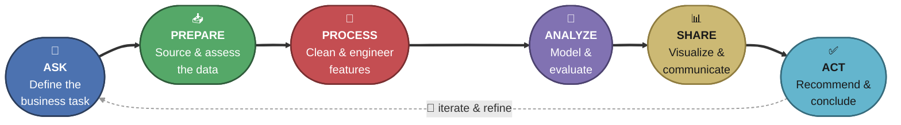
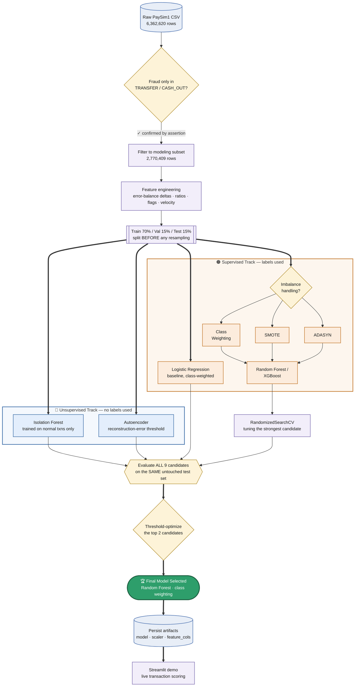
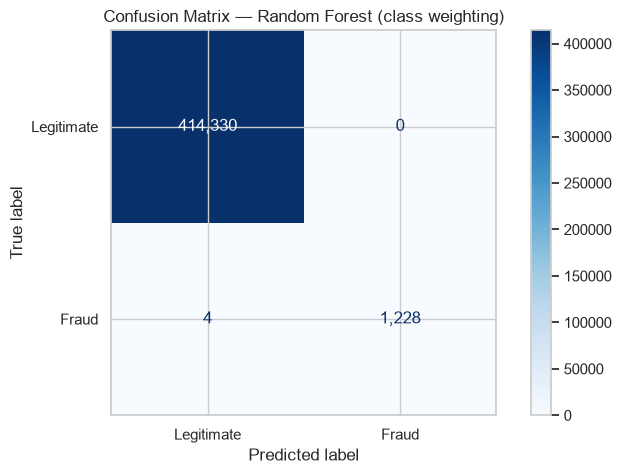

# 🔍 Fraud Detection System

**Data Science Internship Project — Codec Technologies**


A fraud-detection pipeline built on [PaySim1](https://www.kaggle.com/datasets/ealaxi/paysim1), a 6.36-million-row synthetic mobile-money dataset. Eight modeling experiments — spanning unsupervised anomaly detection and supervised classification, with three different imbalance-handling strategies — are compared head-to-head on an untouched test set, and the winner is picked fairly rather than assumed.

**Headline result:** the final model catches **99.68% of fraud with zero false positives** (F1 = 0.9984, AUC-ROC = 0.9988) on 415,562 held-out test transactions.

---

## Table of Contents

- [About the Project](#about-the-project)
- [Internship & Course Background](#internship--course-background)
- [The Six-Phase Analysis Framework](#the-six-phase-analysis-framework)
- [Project Roadmap & Timeline](#project-roadmap--timeline)
- [Machine Learning Workflow](#machine-learning-workflow)
- [Modeling Techniques, Tools & Metrics](#modeling-techniques-tools--metrics)
- [Tools & Tech Stack by Phase](#tools--tech-stack-by-phase)
- [Visualization Reference](#visualization-reference)
- [Repository Structure](#repository-structure)
- [Setup](#setup)
- [Usage](#usage)
- [Results at a Glance](#results-at-a-glance)
- [Key Findings](#key-findings)
- [Limitations](#limitations)
- [Dataset & Citation](#dataset--citation)

---

## About the Project

> ### Fraud Detection System
> **Goal:** Detect fraudulent transactions in financial data.
>
> **Guidelines:**
> - Use anomaly detection or classification (Isolation Forest, Autoencoders)
> - Handle class imbalance with techniques like SMOTE
> - Use performance metrics like F1-score and AUC-ROC

That is the original brief for this internship project. Everything else in this repository — the 8-experiment comparison matrix, the leakage-safe feature engineering, the fair threshold-optimized model selection, and the interactive demo — is this brief carried out end-to-end on a real 6.3-million-row dataset, following the same six-phase analysis cycle taught throughout the internship's foundational coursework (see below).

| | |
|---|---|
| **Task** | Binary classification — flag fraudulent transactions in near-real time |
| **Dataset** | PaySim1, 6,362,620 transactions, 8,213 fraud (0.13%) |
| **Approach** | 8-experiment comparison matrix (unsupervised + supervised, 3 imbalance strategies) + fair threshold-optimized final selection |
| **Final model** | Random Forest (class weighting), threshold 0.8967 |
| **Result** | F1 = 0.9984 · Precision = 1.0000 · Recall = 0.9968 · AUC-ROC = 0.9988 |
| **Full write-up** | [`Fraud_Detection_Report.md`](./Fraud_Detection_Report.md) |

---

## Internship & Course Background

This project is the **Week 8 capstone** of an 8-week Data Science internship at **Codec Technologies**, built together with the Codec Technologies developer team.

### Internship Curriculum

| Week | Focus | Ties to This Project |
|---|---|---|
| 1 | Introduction to Data Science | Framed the business task and the six-phase analysis cycle used throughout (see below) |
| 2 | Data Cleaning and Preprocessing | Duplicate/null checks, balance-reconciliation integrity checks, leakage-safe feature engineering |
| 3 | Exploratory Data Science (EDA) | Class-imbalance, transaction-type, amount, and time-based EDA (Section 4 of the report) |
| 4 | Advanced Data Science | Velocity features, train/val/test methodology, reproducible environment setup |
| 5 | Machine Learning Basics | Logistic Regression baseline, Isolation Forest, Autoencoder |
| 6 | Applied Machine Learning | Random Forest & XGBoost experiment matrix, SMOTE/ADASYN, hyperparameter tuning |
| 7 | Big Data and Cloud Computing | Handling a 6.3M-row / 470+ MB dataset efficiently (dtype optimization, chunked reasoning about scale) |
| 8 | **Final Project** | **This repository** — end-to-end fraud detection system, presented with Codec Technologies developers |

### Foundational Coursework: Google Data Analytics Professional Certificate

| Week | Course | Core Content | Applied in This Project |
|---|---|---|---|
| 1 | Foundations: Data, Data, Everywhere | The 6-phase analysis process, analytical thinking, the data ecosystem | Structures the whole project end-to-end |
| 1 | Ask Questions to Make Data-Driven Decisions | SMART questions, problem framing, “spotting an unusual occurrence” as a problem archetype | Ask phase — business task & success criteria |
| 2 | Prepare Data for Exploration | The ROCCC data-quality framework, sampling/observer/confirmation bias, data ethics | Dataset ROCCC assessment, synthetic-data caveats |
| 3 | Process Data from Dirty to Clean | Data integrity, the “dirty data” taxonomy, cleaning workflows | Integrity checks, balance-reconciliation logic, leakage-safe feature engineering |
| 4 | Analyze Data to Answer Questions | Aggregation, GROUP BY-style analysis, pattern-finding, joins | EDA, fraud-by-type breakdowns, the 8-experiment comparison matrix |
| 5 | Share Data Through the Art of Visualization | Chart selection, dashboarding, storytelling with data | ROC/PR curves, correlation heatmaps, SHAP plot, the Streamlit demo |
| 6 | Data Analysis with R Programming | Tidyverse/dplyr, ggplot2, R Markdown, reproducibility | Reproducible environment practices (`requirements.txt`, notebook) — implemented in **Python** rather than R |
| 7 | Google Data Analytics Capstone | End-to-end case study structure, portfolio packaging | This report's problem → data → methods → results → recommendations |

The certificate teaches this six-phase workflow using spreadsheets, SQL, Tableau, and R.
**This project implements the same six-phase cycle end-to-end in Python** — pandas/NumPy in place of spreadsheets, scikit-learn/XGBoost/TensorFlow in place of a BI tool, and Jupyter/GitHub in place of Tableau dashboards.

---

## The Six-Phase Analysis Framework

Every phase of this project maps directly onto the cycle introduced in Week 1 (Video 1) and used as the backbone of the entire Google Data Analytics Certificate:



| Phase | What It Means Here | Primary Output |
|---|---|---|
| **Ask** | Define the fraud-detection business task and SMART success criteria (F1 ≥ 0.80, AUC-ROC ≥ 0.95) | Problem statement (Report) |
| **Prepare** | Download PaySim1, assess it against the ROCCC criteria, document schema and the TRANSFER/CASH_OUT-only fraud pattern | Dataset overview (Report) |
| **Process** | Integrity checks, leakage-safe feature engineering, velocity features, train/val/test split before resampling | Modeling-ready feature set (Report) |
| **Analyze** | Run the 8-experiment matrix, tune the strongest model, fairly compare finalists at their own optimal thresholds | Results table + selected model (Report) |
| **Share** | ROC/PR curves, confusion matrix, correlation heatmaps, SHAP feature importance, optional Streamlit demo | 14 result visualizations (`assets/`) |
| **Act** | Recommend an operating threshold, document limitations, package as a portfolio-ready GitHub repository | Recommendations & next steps (Report) |

---

## Project Roadmap & Timeline

### Suggested Timeline (from the project plan)
 
| Week | Phase(s) | Planned Focus |
|---|---|---|
| Week 1 | Ask + Prepare | Problem framing, SMART success criteria, dataset download/assessment |
| Week 2 | Prepare (cont.) | Environment setup, dataset ROCCC assessment, initial EDA |
| Week 3 | Process | Data integrity checks, leakage-safe feature engineering |
| Week 4 | Process (cont.) | Velocity features, train/validation/test split |
| Week 5 | Analyze | Baseline model, Isolation Forest & Autoencoder, first supervised models (class weighting) |
| Week 6 | Analyze (cont.) | SMOTE/ADASYN experiments, hyperparameter tuning, final model selection |
| Week 7 | Share | Visualizations, optional Streamlit demo, written report & GitHub packaging |
| Week 8 | Act + Presentation | Recommendations, limitations, internship presentation/demo, polish |


### Actual Execution Roadmap

In practice, the unsupervised and supervised tracks were developed together in a single notebook, and the final model, report, and README went through a reconciliation pass once the real (not synthetic-sandbox) results came in. Each stage below is color-coded to match its phase in the six-phase framework:

```mermaid
%%{init: {"flowchart": {"curve": "basis"}, "themeVariables": {"fontSize": "14px"}}}%%
flowchart TD
    subgraph W1["🎯📥&nbsp; WEEK 1 &nbsp;·&nbsp; Ask + Prepare"]
        direction TB
        A1(["Define business task<br/>& SMART criteria"])
        A2(["Set up venv, Git<br/>& Kaggle access"])
        A3(["Download PaySim1<br/>6.36M rows"])
        A4(["Dataset overview &<br/>integrity checks"])
        A1 --> A2 --> A3 --> A4
    end

    subgraph W2["🧹&nbsp; WEEK 2 &nbsp;·&nbsp; Process"]
        direction TB
        B1(["Confirm fraud only in<br/>TRANSFER / CASH_OUT"])
        B2(["Engineer error-balance<br/>deltas, ratios & flags"])
        B3(["Engineer velocity<br/>features"])
        B4(["Train / Val / Test split<br/>— before resampling"])
        B1 --> B2 --> B3 --> B4
    end

    subgraph W34["🔬&nbsp; WEEKS 3–4 &nbsp;·&nbsp; Analyze"]
        direction TB
        C1(["Baseline model<br/>Logistic Regression"])
        C2(["Unsupervised track<br/>Isolation Forest + Autoencoder"])
        C3(["Supervised track: RF & XGBoost ×<br/>class-weight / SMOTE / ADASYN"])
        C4(["Hyperparameter tuning<br/>RandomizedSearchCV"])
        C5(["Fair threshold-optimized<br/>final selection"])
        C1 --> C2 --> C3 --> C4 --> C5
    end

    subgraph W5["📊&nbsp; WEEK 5 &nbsp;·&nbsp; Share"]
        direction TB
        D1(["ROC / PR curves &<br/>confusion matrix"])
        D2(["SHAP feature<br/>importance"])
        D3(["Streamlit demo"])
        D4(["Written report<br/>+ README"])
        D1 --> D2 --> D3 --> D4
    end

    subgraph W6["✅&nbsp; WEEK 6 &nbsp;·&nbsp; Act"]
        direction TB
        E1(["Recommendations<br/>& limitations"])
        E2(["Reconciliation pass:<br/>numbers, artifacts, .gitignore"])
        E3(["Final polish &<br/>GitHub packaging"])
        E1 --> E2 --> E3
    end

    W1 ==> W2
    W2 ==> W34
    W34 ==> W5
    W5 ==> W6

    classDef askprepare fill:#4C72B0,color:#ffffff,stroke:#2c3e5c,stroke-width:1.5px,rx:8,ry:8
    classDef process    fill:#C44E52,color:#ffffff,stroke:#7a2f31,stroke-width:1.5px,rx:8,ry:8
    classDef analyze    fill:#8172B2,color:#ffffff,stroke:#4d4370,stroke-width:1.5px,rx:8,ry:8
    classDef share      fill:#CCB974,color:#1a1a1a,stroke:#8f7c3f,stroke-width:1.5px,rx:8,ry:8
    classDef act        fill:#64B5CD,color:#1a1a1a,stroke:#376c7d,stroke-width:1.5px,rx:8,ry:8

    class A1,A2,A3,A4 askprepare
    class B1,B2,B3,B4 process
    class C1,C2,C3,C4,C5 analyze
    class D1,D2,D3,D4 share
    class E1,E2,E3 act

    style W1  fill:#eef2fa,stroke:#4C72B0,stroke-width:2px
    style W2  fill:#fceeee,stroke:#C44E52,stroke-width:2px
    style W34 fill:#f2eef8,stroke:#8172B2,stroke-width:2px
    style W5  fill:#fbf8ea,stroke:#CCB974,stroke-width:2px
    style W6  fill:#eaf5f9,stroke:#64B5CD,stroke-width:2px
```



---

## Machine Learning Workflow

The modeling pipeline itself — the heart of the Analyze phase — follows a standard, leakage-aware supervised/unsupervised comparison workflow. Node shapes carry meaning throughout: **cylinders** are data at rest, **diamonds** are decisions/branch points, and the **pill-shaped node** is the final outcome.



**Key design choices baked into this workflow:**
- The test set is split off **before** any SMOTE/ADASYN resampling, so it always reflects the real 0.30% fraud rate.
- Both an unsupervised (label-free) track and a supervised (label-based) track are trained, satisfying the project brief's "anomaly detection **or** classification" guideline by doing both and comparing them.
- The final model is chosen by comparing the top two candidates at **each one's own optimal decision threshold**, not by assuming the more complex model (XGBoost) automatically wins over the simpler one (Random Forest).

---

## Modeling Techniques, Tools & Metrics

### Experiment Matrix

| # | Model | Category | Imbalance Technique | Library |
|---|---|---|---|---|
| 1 | Logistic Regression | Supervised (linear) | Class weighting | `scikit-learn` |
| 2 | Isolation Forest | Unsupervised anomaly detection | None (contamination ≈ fraud rate) | `scikit-learn` |
| 3 | Autoencoder | Unsupervised anomaly detection (neural) | None (reconstruction-error threshold) | `tensorflow` / `keras` |
| 4 | Random Forest | Supervised (bagged trees) | Class weighting | `scikit-learn` |
| 5 | Random Forest | Supervised (bagged trees) | SMOTE | `scikit-learn` + `imbalanced-learn` |
| 6 | XGBoost | Supervised (boosted trees) | Class weighting (`scale_pos_weight`) | `xgboost` |
| 7 | XGBoost | Supervised (boosted trees) | SMOTE | `xgboost` + `imbalanced-learn` |
| 8 | XGBoost | Supervised (boosted trees) | ADASYN | `xgboost` + `imbalanced-learn` |
| 9 | XGBoost (tuned) | Supervised (boosted trees) | Class weighting + `RandomizedSearchCV` | `xgboost` + `scikit-learn` |

### Evaluation Metrics

| Metric | What It Measures | Why It Matters Here |
|---|---|---|
| **Precision** | TP / (TP + FP) | False-alarm rate — flagging legitimate customers as fraud damages trust |
| **Recall** | TP / (TP + FN) | Missed-fraud rate — a missed fraud is a direct financial loss |
| **F1-score** ⭐ | Harmonic mean of Precision & Recall | Primary guideline metric — balances the trade-off in one number |
| **AUC-ROC** ⭐ | Area under the TPR-vs-FPR curve | Primary guideline metric — threshold-independent overall comparison |
| **AUC-PR** | Area under the Precision-vs-Recall curve | More informative than AUC-ROC under this dataset's extreme imbalance |
| **Confusion Matrix** | Raw TP / FP / TN / FN counts | Most interpretable artifact for stakeholders — shows exact business impact |

Accuracy was deliberately **not** used to select a model: predicting "not fraud" for every single row already scores ≈99.87% accuracy on PaySim, which would be a meaningless model.

### Model Explainability

| Tool | Role |
|---|---|
| `shap.TreeExplainer` | Beeswarm feature-importance plot for the final tree-based model, so analysts can see *why* a transaction was flagged |

---

## Tools & Tech Stack by Phase

| Phase | Tasks | Tools / Libraries |
|---|---|---|
| **Ask** | Problem framing, SMART success criteria | Markdown documentation (no code) |
| **Prepare** | Dataset download, schema/ROCCC assessment, dataset-overview functions | `pandas`, `numpy`, `kaggle` CLI |
| **Process** | Integrity checks, leakage-safe feature engineering, velocity features, train/val/test split | `pandas`, `numpy`, `scikit-learn` (`train_test_split`, `StandardScaler`) |
| **Analyze** | Baseline + tree models, unsupervised anomaly detection, imbalance handling, hyperparameter tuning | `scikit-learn`, `xgboost`, `imbalanced-learn` (SMOTE/ADASYN), `tensorflow`/`keras` |
| **Share** | Visualization, explainability, interactive demo | `matplotlib`, `seaborn`, `shap`, `streamlit` |
| **Act** | Artifact persistence, reporting, packaging | `joblib`, Markdown, Git/GitHub |

### Full Tech Stack

| Category | Tools |
|---|---|
| **Language** | Python 3.11 |
| **Environment** | `venv` + `pip`, VS Code (Python + Jupyter extensions) |
| **Data handling** | `pandas`, `numpy` |
| **Visualization** | `matplotlib`, `seaborn`, `plotly` |
| **Classical ML** | `scikit-learn`, `xgboost` |
| **Imbalance handling** | `imbalanced-learn` (SMOTE, ADASYN) |
| **Deep learning** | `tensorflow` / `keras` (Autoencoder) |
| **Explainability** | `shap` |
| **Deployment demo** | `streamlit` |
| **Data source** | `kaggle` CLI + API token |
| **Version control** | Git + GitHub |

Exact pinned versions are in [`requirements.txt`](./requirements.txt).

---

## Visualization Reference

All 14 figures live in [`assets/`](./assets) and are generated directly by the notebook (each plotting cell saves to `assets/` before displaying inline).

| # | File | Plot Type | What It Shows |
|---|---|---|---|
| 01 | `01_class_imbalance.png` | Bar chart | Legitimate vs. fraudulent transaction counts |
| 02 | `02_type_breakdown.png` | Dual bar chart | Transaction count and fraud count by transaction type |
| 03 | `03_amount_histogram.png` | Histogram (log-scaled x-axis, density-normalized) | Transaction amount distribution by class |
| 04 | `04_amount_boxplot.png` | Boxplot (log-transformed amount) | Amount spread and outliers by class |
| 05 | `05_fraud_over_time.png` | Line chart + bar chart | Fraud count by simulated day and by hour of day |
| 06 | `06_balance_zeroing_pattern.png` | Bar chart | Share of transactions that drain the sender's account, by class |
| 07 | `07_amount_vs_balance_scatter.png` | Scatter plot (log-log, sampled) | Amount vs. sender's pre-transaction balance, colored by class |
| 08 | `08_raw_correlation_heatmap.png` | Heatmap | Linear correlation among raw numeric columns |
| 09 | `09_autoencoder_training_loss.png` | Line chart | Autoencoder training vs. validation loss curves |
| 10 | `10_roc_curve_comparison.png` | Multi-series line chart | ROC curves for all 9 experiments |
| 11 | `11_pr_curve_comparison.png` | Multi-series line chart | Precision-Recall curves for all 9 experiments |
| 12 | `12_engineered_correlation_heatmap.png` | Heatmap | Linear correlation among engineered model features |
| 13 | `13_confusion_matrix_final.png` | Confusion matrix (annotated heatmap) | Final model's predictions vs. actual labels |
| 14 | `14_shap_summary.png` | SHAP beeswarm plot | Per-feature contribution to individual fraud predictions |

**Why these plot types:** bar/dual-bar charts for categorical comparisons (class, type), histograms/boxplots for distributional questions (amount), line charts for anything sequential (time, training loss, ROC/PR trade-off curves), scatter plots for two-variable relationships, heatmaps for many-variable correlation at a glance, and the confusion matrix + SHAP beeswarm as the two most stakeholder-friendly ways to explain *what* the final model got right or wrong, and *why*.

---

## Repository Structure

```
Fraud-Detection-System/
├── fraud-detection-system.ipynb   # Full analysis: EDA → features → modeling → evaluation
├── exports/                       # Rendered exports of the notebook (HTML/PDF) — viewable without Jupyter
├── Fraud_Detection_Report.md      # In-depth written report (problem → data → methods → results → recs)
├── README.md                      # You are here
├── streamlit_app.py               # Optional interactive demo — live fraud-risk scoring
├── requirements.txt               # Pinned Python dependencies
├── project-hierarchy.txt          # Snapshot of the local project layout
├── .gitignore
├── assets/                        # 14 result figures used by the report/README (tracked)
├── data/                          # PaySim1 CSV — gitignored, see Setup
├── models/                        # Saved model artifacts — gitignored, generated by the notebook
└── .kaggle/                       # Kaggle API token — gitignored, never committed
```

## Setup

1. **Create and activate a virtual environment**
   ```bash
   python -m venv .venv
   # Windows
   .\.venv\Scripts\Activate.ps1
   # macOS/Linux
   source .venv/bin/activate
   ```

2. **Install dependencies**
   ```bash
   pip install -r requirements.txt
   ```

3. **Get the dataset** — download PaySim1 via the Kaggle CLI (requires a `kaggle.json` API token in `.kaggle/` or `~/.kaggle/`):
   ```bash
   kaggle datasets download -d ealaxi/paysim1
   ```
   Unzip the CSV into `data/`.

## Usage

**Run the full analysis**
Open `fraud-detection-system.ipynb`, update `DATA_PATH` if your filename differs, and run all cells. This performs EDA, engineers leakage-safe features, runs all 9 experiments plus tuning, and saves the winning model to `models/`. Every plot is written to `assets/` automatically as it's generated.

Prefer not to install Jupyter first? Open the rendered export in `exports/` in any browser to see the fully executed notebook, outputs and all.

**Try the interactive demo**
Once the notebook has run at least once (so `models/final_model.joblib` exists):
```bash
streamlit run streamlit_app.py
```
Enter a transaction's details to get a live fraud-risk score. Note that the demo defaults an account's transaction history to zero, since a single submitted transaction has no prior activity to look up — see the report's Limitations section.

## Results at a Glance

| Experiment | Precision | Recall | F1 | AUC-ROC |
|---|---|---|---|---|
| **Random Forest (class weighting)** ⭐ | 0.998 | 0.997 | **0.9976** | 0.9988 |
| XGBoost (tuned) | 0.972 | 0.998 | 0.9848 | 0.9993 |
| XGBoost (SMOTE) | 0.957 | 0.998 | 0.9769 | 0.9991 |
| XGBoost (ADASYN) | 0.932 | 0.998 | 0.9635 | 0.9989 |
| XGBoost (class weighting) | 0.866 | 0.998 | 0.9272 | 0.9987 |
| Random Forest (SMOTE) | 0.809 | 0.998 | 0.8935 | 0.9986 |
| Autoencoder (unsupervised) | 0.196 | 0.199 | 0.1976 | 0.9293 |
| Logistic Regression | 0.059 | 0.930 | 0.1116 | 0.9883 |
| Isolation Forest (unsupervised) | 0.017 | 0.017 | 0.0168 | 0.8300 |

At their own optimal decision thresholds, Random Forest and tuned XGBoost **tied exactly** (F1 = 0.9984 each) — see the report for how the final model was picked fairly rather than assumed.

<p align="center">
  
</p>

## Key Findings

- **Fraud occurs only in TRANSFER and CASH_OUT transactions** — confirmed and asserted in code before any modeling began.
- **Raw balance columns are unreliable as features.** Merchant destination accounts always show zero balances (100% confirmed), and 65–80% of all rows fail a simple balance-reconciliation check — both replaced with leakage-safe engineered deltas (`errorBalanceOrig`, `errorBalanceDest`).
- **Class weighting beat SMOTE and ADASYN** for both Random Forest and XGBoost on this dataset — synthetic oversampling consistently cost precision here.
- **PaySim's own `isFlaggedFraud` rule catches only 16 of 8,213 frauds** — every trained model here substantially outperforms the naive baseline.
- **Linear correlation with `isFraud` is weak everywhere** (max ≈ 0.08 for any single raw or engineered feature) — fraud in this dataset is only separable through nonlinear feature interactions, which is why tree-based models dominate the comparison.

## Limitations

PaySim is synthetic and time-boxed to 30 simulated days; extreme class imbalance means results are sensitive to threshold choice; and the unsupervised models' thresholds were tuned using labels that wouldn't be available in a true production deployment. Full discussion, including a known SHAP-plotting quirk with `RandomForestClassifier` and its fix, is in the report.

## Dataset & Citation

Lopez-Rojas, E., Elmir, A., Axelsson, S. "PaySim: A financial mobile money simulator for fraud detection." *28th European Modeling and Simulation Symposium*, 2016. Available on [Kaggle](https://www.kaggle.com/datasets/ealaxi/paysim1).

## Author

**Sudharshan Moodley**

[](https://www.linkedin.com/in/sudharshan-moodley-0a1a5b2a9/)
[](https://github.com/Sudharshan205-Proj)